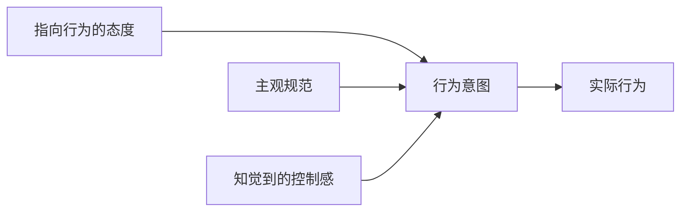
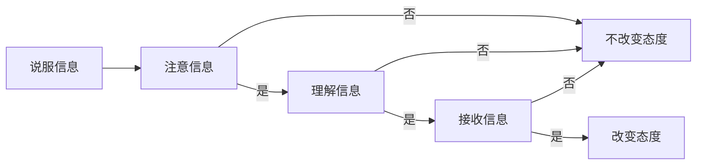
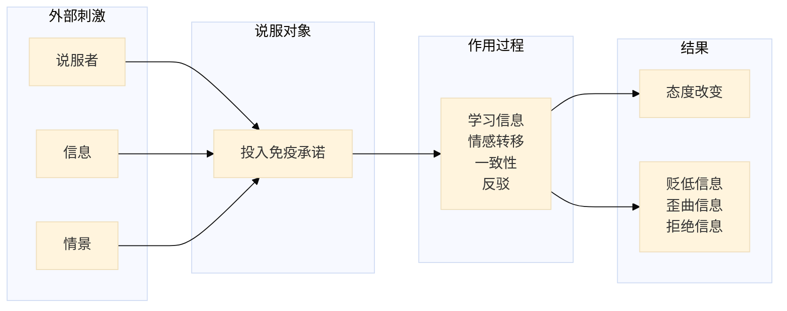
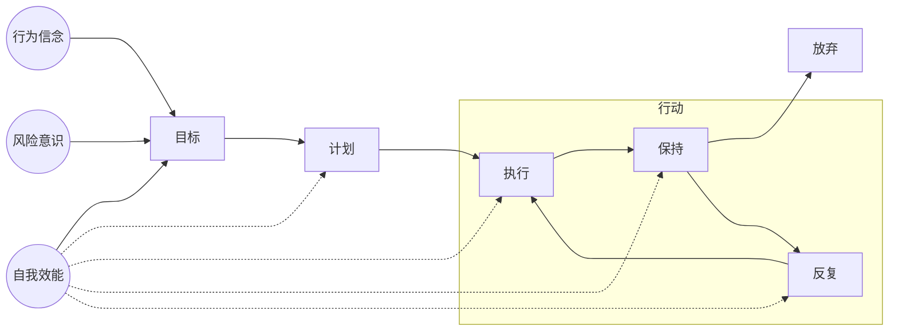

# 社会心理学

<center>侯玉波
</center>

## 第一章 社会心理学导论

### 一、为什么要学习社会心理学

#### （一）认识自己

亚里士多德认为：自我即灵魂，是联合了个体多种知觉的单纯而主动的实体。

学习社会心理学能够使我们对自己有一个更加清楚的认知。

#### （二）认识他人

对他人的认识一般通过两个方面出发：

1. 从对方的人格特点出发，知道对方是一个什么样的人
2. 从情景出发，知道对方在什么情境下会做什么样的事

社会心理学主要强调从第二个方面来认识他人。

在当今人格心理学中，对于人格特质最有影响力的理论有两个，一个是Cosata和McCare等研究者提出的 **“big-five”** 理论。另一个是我国学者王登峰提出的 **“big-seven”**。

| Big-Five                                                     | Big-Seven                                                    |
| ------------------------------------------------------------ | ------------------------------------------------------------ |
| - 神经质（neuroticism）：指个体的情绪稳定性和情绪调节情况。得分高的人经常有悲伤、由于和愤怒的情绪；得分低的人则可以保持情绪平静不会大悲大喜。<br />- 外向性（extraversion）：指个体如何对待与他人的交往等。得分高的人乐于交际，精力充沛；得分低的人则比较含蓄稳健<br />- 开放性（openness）：指个体能否接受新思想和对未知事物的探索等方面持开放态度。得分高的人不容易循规蹈矩，喜欢独立思考；得分低的人喜欢熟悉的事物，并且比较传统。<br />- 宜人性（agreeableness）：指个体对待他人的态度。得分高的人有同情心，注重和他人的合作；得分低的人喜欢竞争，会为信念或利益与他人斗争<br />- 尽责性（conscientiousness）：指个体做事的态度，扽分高的人做事有计划，有恒心，善于自律；得分低的人则容易转移兴趣和注意力，做事不拘小节。 | - 外向性：指个体活跃、合群、乐观                                                                                                                                                              <br />- 善良：指个体利他、诚信、重感情<br />- 行事风格：指个体严谨、自制、沉稳<br />- 才干：指个体决断、坚韧、机敏<br />- 情绪性：指个体有耐性、直爽<br />- 人际关系：指对人热情、宽和<br />- 处事态度：指个体自信、淡泊名利 |

*Big-Five和Big-Seven既有共同的成分，也有属于西方人和中国人的独特内涵*

#### （三）认识社会

通过学习社会心理学，我们能够理解自己所处的社会的特性以及在这样的社会中个体的可能反应，从而有助于我们更好滴适应社会

#### （四）认识生活的意义

生活的意义在于四个方面有优势：

- 能够自主：做自己的事情能够自己决定么不是有他人决定
- 能力：能有足够的实力把自己决定的事情或者他人交代的任务完成
- 关系：在生活中和他人建立起密切的联系，而不是孤军奋战
- 自尊：对自己有清醒的认识和积极的评价

### 二、什么是社会心理学

#### （一）社会心理学的定义

20C80年代：美国社会心理学家Freedman，从行为主义心理学视角出发，认为社会心理学是系统研究社会行为的科学。

认知革命之后：Myers，从社会认知的角度出发，认为社会心理学是研究人们怎么想，怎么相互影响以及怎样与别人相联系的科学。

国内的观点：吴江霖：社会心理学是研究个体或若干个体在特定社会生活条件下心理学活动的变化发展的科学。

沈德灿：社会心理学是研究个体和群体的社会心理学、社会行为及其发展规律的科学。

#### （二）社会心理学与常识

社会心理学与常识有很多的不同，之所以不同，有两种原因：

- 与人类的非理性行为有紧密的关系：人类的行为并不是完全有意识与理性指引的。
- 意识形态对社会心理学的影响

#### （三）社会心理学的三个研究领域

1. 个体过程
2. 人际过程
3. 群体过程

### 三、社会心理学简史

#### （一）学派时期的社会心理学

#### （二）社会心理学的产生与发展

-----------

## 第二章 社会心理学的理论与方法

### 一、社会心理学研究的基本问题

#### （一）假设与理论

对科学研究的假设有三个要求：

- 第一，可证真伪。
- 第二，量化表达。
- 第三，简洁清晰。

评价一个理论好坏的标准有四个：

- 准确性：理论如果不鞥准确滴预测现象发生规律，就不是一个好理论
- 一致性：用理论解释现象的时候不能前后矛盾，应该保持一致性。
- 简洁性：理论不能太复杂，应该简明扼要地对事件之间的关系做出描述
- 广泛性：理论应该能够解释一系列现象，不能直接是某些特殊的现象

理论的价值体现在四个方面：

- 统和现有的知识
- 解释已有现象
- 预测性
- 指导研究方向

与=社会心理学家所建立的是更精确的**“微理论”**，这些理论强调人类行为的某一具体方面，能偶对这些行为作出预测，并可以通过实证研究加以检验。

#### （二）社会心理学研究的两种取向

|                | 心理学中的社会心理学 | 社会学的社会心理学           |
| -------------- | -------------------- | ---------------------------- |
| 强调的重点     | 个体的心理学与行为   | 团体或社会的影响             |
| 理解行为的途径 | 分析心理状态、人格等 | 分析社会变量，如地位、角色等 |
| 首要目标       | 预测行为             | 描述行为                     |
| 方法           | 以实验为主、兼调查   | 调查和参与观察是主要方法     |

#### （三）社会科学研究的三个层面

1. 社会层面

	在社会层面的研究中，社会学家和政治学常常会认用比较广泛的因素来解释社会行为。社会心理学家则会更加关注人挤层面。社会学家会研究人们的行为和社会变量的关系。而社会心理学家则会更加倾向于研究人们的行为和更为直接的变量之间的关系。

2. 人际层面

	社会心理学家常常用个体当时所处的情境及个体与周围他人的人际关系来解释行为。

3. 个人层面

	一个人的特质可以用来解释他的行为，人格特质可以用来解释在相同情境下，人们为何采用不同的行为方式。临场心理学和社会心理学都研究人们如何在社会情境中应对焦虑或压力，都研究受压抑或不受压抑的个体在处理信息、对行为进行归因、寻求互动等方面的差异。

### 二、社会心理学的基本理论

#### （一）生物理论

生物理论强调两个方面的因素对人类行为的决定作用：

- 本能
- 遗传差异

#### （二）学习理论

学习理论强调**经验对行为的影响，认为在任何情境下个体都会学到某种行为，并在多次学习之后成为习惯**，个体将会采用惯用的方式作出反应，当类似的情景再度出现的时候。

1. 学习理论的机制

- 联结(association)：

> 经典条件作用(classical condition)。

- 强化(reinforcement)：

> 指人们学会一种**特别的行为**是因为这种行为伴随着**愉快、能满足某种需要或者可以避免某种不愉快的后果**。

==强化是学习理论的核心==

- 模仿(imitation)：

> 个体通过**观察他人态度**及行为来学习社会态度与行为

模仿的发生**并不需要外界的强化**，只须观察他人的行为和结果便可以产生。在这里，模仿机制对于儿童是社会学系的重要机制，但是对成人来说，未必有效。

2. 学习理论的特点

- 学习理论强调过去的经验对个体行为的影响，忽略了当时的情景细节，假定行为主要由个人过去的学习经验而来。
- 学习理论倾向于将**行为的原因归于外在环境，而忽略个人对环境的主观感受**。它强调过去的外部事件与刺激的联结情形、早起对某种行为反应的强化过程以及个体曾接触过的行为模式等外在因素。
- 学习理论通常**只想解释外表的行为而非主观的心理状态**。

#### （三）诱因理论

1. 理性决策论(rational decision making theory)

	> 理性决策论：在选择的时候，人们会顾及不同行为的利益及代价，**而以理性的方式作出最佳选择**，**也就是以最低代价获得最大利益**

	Edwards的预期价值论(expectancy value theory)最具有代表性：该理论认为，在决策的时候，人对下列两项因素所作出的判断结果为基础：

   - 某一决策各种可能后果的价值；
   - 某一决策后果真正实现的可能性大小

2. 交换理论(exchange theory)

	> 这一理论将人际互动是为彼此所做的一连串理性决策。也就是说，人们之间的互动取决于**彼此对各种结果的代价及利益所做的评估**。

	社会交换理论的重点在于强调**相对代价及利益**，该理论在分析协商情景时很价值。

3. 需求满足理论(need satisfaction)

	> **需求满足论认为每个人都有某种需求或动机**，一个人之所以有某种行为，是因为这种行为能满足这些需求或动机。

以上三种诱因理论都说明了个体面对多种选择时，依照自己能从**各个行为方案中获得或损失多少利益来做决策**。与学习理论不同，诱因理论将重点放在**当时情境下的可能行为的相对利益与损失**。也就是说，诱因理论认为行为的起因在于**个人所处的环境**，诱因论关心个人的内在状态而不是环境因素。

#### （四）认知理论

> 认知理论(congnitive theory)认为人的行为会取决于对**社会环境的直觉和加工过程**。

人们常常将社会情境的直觉、想法、信念组成一个简单而又有意义的形式，就像对物体的直觉一样，并且可以将它变得有规律。它影响了一个人对社会情境的反应。而这个过程被称为社会认知[^社会认知](social congnitive)。

1. 两个基本原则

   - 分类(categorization)：人们知觉事物的时候，往往先根据一些简单的原则将事物进行分类。
   - 聚焦(focus)：人们将注意力集中到主题上，忽略背景的影响。

	人们往往存在着按照某种方式对事物加以组织的倾向，并且这种将事物加以组织的倾向非常强烈。

2. 两个重要的认知理论

	> 归因理论(attribution theory)：这个理论主要是想说明我们如何解释时间的原因

	> 认知失调理论(theory of cognitive dissonance )：这个理论主要解释当人们态度与行为不一致的时候，人们如何改变自己的态度。

#### （五）角色理论

> 角色理论：角色理论强调**个体的行为是由其社会角色提供的**。

角色理论通过没有强调某种单一决定因素，二十从角色、角色期望、角色技能等方面的**相互关系**去解释行为的原因。角色理论有助于我们了解为什么人们的行为会随着她们在社会系统中的位置的变化而发生变化。

在社会心理学中，与此比较接近的是社会认同理论。

### 三、社会心理学的研究过程与方法选择

#### （一）问题的提出

人们往往从两个角度提出问题，一个是从理论中演绎出研究问题，另一个是从实践中提出问题。

#### （二）阅读文献

#### （三）研究方法选择

1. 相关研究

	相关研究是指被动观察两个变量之间关系的研究方法。相关可以分为正、负、零相关。

	相关研究存在的问题：**不能说明因果关系**，并且有的时候有**中介因素**的影响。

2. 实验研究

	实验研究是认为安排两种或多种在某一维度上的不同情景，并把被是随机分配到这些情境中，然后测量感兴趣的行为，并探寻自变量与因变量之间关系的方法。
	
	实验研究法最大的优点：**对变量有着严格的控制，所以避免了因果关系的混淆**，并且结果可以**重复验证**，有比较高的效度。

实验研究法需要控制的要求：**自变量可以操纵以及被试随机分配**。

#### （四）收集数据
1. 观察法

	优点：简单易行，获取一手资料

	缺点：特定种类的行为很难观察（私密行为）；消耗时间长；范围内容特定

2. 调查法

	优点：使用有代表性的样本，简单易行，可以收集大量资料

	缺点：过分依赖自我报告，但是自我报告有时候不一定准确

3. 实验法

	优点：得到的资料准确可信

	缺点：如果样本没有代表性，则结论无法推广

	在行为中，某种因素对因变量的影响叫做主效应，交互作用则是指某个因素对因变量的影响受这个因素之外的其他因素的共同作用。

4. 档案研究法

	优点：可以排除情境对行为的影响
	缺点：记录内容不完整，不够详细，搜集方式不够系统

5. 元分析方法

	元分析方法：运用一套统计程序从一个 新的角度对已开展或已经报告的有关研究进行检验分析。

#### （五）研究设计

#### （六）研究中应注意的问题

- 样本的代表性：要采取**随机取样的方式**，是每个人都有同等的被选择的机会，并且要崩要尽量**异质化**。
- 实验者偏差：在研究中要尽量采取**单盲或者双盲实验**，使实验者的影响达到最小
- 被试偏差：**被试的社会赞许倾向会让她们试图揣摩实验者的研究意图**，从而影响实验的有效性，所以最好不要让被试知道实验假设。
- 伦理问题：在研究中要尽量**避免对被试造成伤害**，有时也会涉及欺骗的内容，实验的隐瞒一般是可以的，但是实验结束后有必要告知被试事实和研究目的。

#### （七）论文的撰写

---------

## 第三章 自我

### 一、关于自我研究的历史

从人类诞生的那一天起，我们就在考虑自我的问题。

> 认识你自己！——希腊戴尔菲神庙

亚里士多德的观点：
​把自我看成一个**单纯而又主动的实体**，即灵魂，并认为灵魂**联系了各种知觉**。

洛克的经验主义角度观点：
将自我与人的记忆相联系，认为**人的统一性是由我们的记忆完成的**。

启蒙运动中休谟的观点：
自我完全是**虚构的**，只有“我”这个代名词所致的幻想的东西。

康德的观点：
**超验的自我**

实验心理学家的观点：
**自我是一个虚妄的存在**

威廉詹姆斯（重新将自我的概念引入心理学的研究中去）：
将自我区分为：**经验的自我、纯粹的自我**，前者包括**物质自我、社会自我、精神自我**。而这一部分是可以进行实证研究的。
威廉詹姆斯的自我知觉具有**二元性**，自我既是由**对自己的看法与信念**所组成的**”宾我“**，又是一个活跃的**信息处理器**——**主我**。

库勒的观点：
自我是通过**人际关系建立的自我**，不仅仅是一个个人实体，还是**社会的产物**，他把widow的这个方面叫做**投射自我(reflected-self)**or**镜中自我(looking-glass self)**。人们不仅想象**他人如何看待自己**，而且想象**他人如何评价他们眼中的自己**，以及人们对这些反射性评价的情绪反应。

Mead的观点：
强调**社会经验**在自我形成中的作用，指出，当个体与已成为其客体的其他人可以比较的时候，个体只有采取在某一社会环境中其他个体对自己的态度时，互动才能进行，没有社会经验，自我便不可能产生。

沙利文的观点：
十分强调**自我发展的社会和人际关系基础**，强调**家庭成员对儿童自我形成的直接作用**，认为“自我”的概念只有在人与人的关系中才能进一步发展。

Eormuth的观点：
将**客体、他人和环境**整合为一个自我生态系统，认为自我概念与自我生态系统**相互依存、相互影响，在互动中实现动态平衡**。

Tajfel & Turner的观点：
社会认同理论：认为**社会关系**是自我概念的重要组成部分，人们努力使自己的自我感觉良好，当人们发现自己所属的群体比其他群体更好的时候，感觉更好。

弗洛伊德的观点：
自我是人格结构的重要组成部分之一，另外两个组成部分是本我和超我。自我是自己**可意识到的执行思考、感觉、判断**的部分，自我的机能是**寻求本我的满足，保护机体不受伤害**，遵循**现实原则**。

Rosenberg的观点：
认为自我的概念是**个体对自我个体的思想和情感的总和**，是个人**自我知觉的组织系统**，代表一个人看待自身的方式。

Shavelson的观点：
认为自我概念是通过**经验和对经验的理解而形成的自我知觉**。这种知觉源于对**人机互动、自我属性和社会环境的经验体验**，是多维度。

Markus与Wurf的观点：
动态自我的概念，她们认为自我概念在内容和结构上是一个**多面体**，是不同**印象、图式、概念、原型、理论、目标、任务的集合体**，自我的概念是动态的，特定情况下只有部分被激活。

### 二、和自我有关的概念

#### （一）自我图式

自我图式是我们用来组织和指引与自己有关的一套自我信念。

> 自我参照效应( self-reference effect )

人们在加工和自我有关的内容时效率更高，记忆效果也最好。

> 自我差异理论( self-discrepancy )

个体知觉到的自我概念包括三个部分：**理想自我（idea self），应该自我（ought self），实际自我（actual self）**，理想自我和应该自我具有**自我指引的作用**：

- 理想自我指引着个体对目标的追求
- 应该自我使得我们回避一些目标

实际自我和理想自我之间存在的差距，会促使人们缩小二者之间的距离，否则会产生沮丧的情绪。不能缩小实际自我和应该自我之间的距离的话，会引发愤怒的情绪。

个体的自我概念的构建与一下几个方面有关：

- 从自己的行为推断自己，人们常有自己的所作所为来推断自己的内在自我概念，我做了什么，我就是什么样的人。
- 从他人的行为推断自己：人们会猜测他人认为“我”怎么样
- 通过社会比较推断自我：通过与别人对比，人们常常会对自己有更清楚的认知。
- 通过自我意识来推断自我：反省自己来了解自我

>  社会互动理论( social interaction theory )

社会生活中人们之间有意义的交流导致了自我和社会现实的整合，**自我就是一个人通过行为展现自己时使用的符号**，**自我概念就是一个人用来定义自己的思想和情感的总和**。

#### （二）自我觉知

> 自我觉知(self-awareness)：是指**个体把自己当作注意对象时的心理状态**。

根据自我觉知理论，当我们集中注意力与自己时，我们会根据自己的**内在标准与价值观来对自己现在的行为进行评价和比较**。

自我觉知有两种分类：

- 内在自我觉知（private self-awareness）：个体对自己内部特征和感受比较重视。
	- 内在自我觉知占优者对自己的感受比较在乎因此他们会常常夸大自己的反应
	- 对自己的特征比较关注，所以自我概念中内在事件清楚而明确。
	- 常常坚持自己的行为标准与信念，不太会受外界环境的影响
- 公众自我觉知（public self-awareness）：个体对自己的外在方面比较在意。
	- 公众自我觉知占优者太看重外界他人的影响，所以害怕别人的评价，担心别人对自己有不好的评价。
	- 常常产生暂时性的自尊感低落，容易在理想自我与实际自我之间产生距离。
	- 常常在乎外界的行为标准。

#### （三）自尊 

> 自尊（self easteem）是人的自我概念中与情绪有关的内容。它指一个人**如何肯定与赞扬自己**，是**自我评价的重要维度**。对于自尊有两种区分：外显自尊与内隐自尊。

自尊的研究受到不同地区文化的研究，西方的自尊是一元的而中国的自尊是多元的。中美两种文化下，自尊的变异都可以通过三个方面来解释：仁慈、品质和积极自我偏差。

确立自尊的两条途径：

- 让个体有自己控制环境的成功经验
- 让他人对自己有积极的评价

一系列提升自尊的方法：

- 学会用自我服务的方式去解释生活
- 用自我障碍的策略为失败找借口
- 使用防御机制否认或逃避消极的反馈
- 学会向下比较以及采用补偿作用
- 在自己某一方面的能力受到怀疑时赚到自己擅长的活动中去

#### （四）自我提升和自我确认


自我提升（self enhancement）也叫做自我美化或者自我强化，它是指个体以一种**有利于对自己做正面评价的方式收集和解释有关自我的信息**。

​	从某种意义上来看，自我提升是一种**自利偏差**。

自我确认（self- verification）是指额题**寻找和解释情境，以证实自我概念的过程**。通过自我确认，是别人对自己有**一致性认识**，也有助于提高自尊水平。

#### （五）自我效能

自我效能（self- efficacy）是指一个人对自己**有能力完成待定任务的信念**。

- 人可以从对自己的能力与效率的乐观信念中获得巨大回报。

- 自我效能指引人们制定有挑战性的目标，并且在面对苦难的时候更加坚强

#### （六）自我表演

自我表演（self-presentation）也叫自我展示，它是指人们在别人对自己**形成印象时所做的显露**。我们致力于管理营造的形象，我们通过**推脱、辩护和道歉等方式来支撑我们的自尊并检验我们的自我形象**。

#### （七）自我障碍

自我障碍（self- handicapping）是指人们**提前准备、用来解释自己预期失败**的一系列行为。

#### （八）自我检控

自我检控（self- monitor）是指人们在与他人的交往过程中，**通过观察他人自我表演的线索来对自己的自我表演加以控制**。

​	高的自我检控的人善于在别人面前表演，能根据情境与特人的需要来塑造自己的行为；低的自我检控的人不善于在别人面前表演，不看重情境与他人的影响，表达的是自己真实的态度和感受。

#### （九）自证预言

自证预言（self- fulfilling prophecies）也叫自我实现的预言，是指我们对他人的**期望也会影响对方的行为，使得对方按照我们的期望行事**。

#### （十）体像

体像（body image）是用来描述与个体对自己躯体知觉有关的现象的总称。


### 三、自我偏差

#### （一）焦点效应

焦点效应（spotlight effect）指的是人们在**自我观察的时候，会高估自己的突出程度，把自己看成某一情境的中心，并且高估别人对自己的主意度**。

与焦点效应相对应的是透明度错觉（illusion of transparency），即人们认为**自己隐藏的情绪一旦外露，就会被别人发现的错觉**，实际上别人可能根本看不出来。

#### （二）自利偏差

自利偏差也称为自我服务偏见（self- serving bias）。指的是**当我们加工和自我有关的信息时，一边轻易地为自己的失败开脱，一边欣然接受成功的荣耀。并且在很多情况下， 有一种觉得自己比别人好的倾向。**

人们乐于接受成功的荣誉，容易将成功归结为自己的才能和努力，却把失败归咎于运气不佳或者问题本就无法解决这样的外部因素。

自利偏差表现在生活的方方面面：

- 伦理道德：多数生意人认为自己比一般生意人更有道德（exmaple）
- 工作能力：90%的经理人对自己成就的评价超过对其普通同事的评价
- 聪明才能：大部分人觉得自己比周围的人更聪明，更英俊，更没有偏见
- 孝顺父母：多数成年人认为自己对年迈父母的照顾比自己的兄弟姐妹们多
- 摆脱偏见：人们往往认为自己比其他人更不容易受偏见的影响

#### （三）盲目乐观

人们对自己的认知有时候会出现盲目乐观的倾向。

心理学的研究表明，随着时代的发展，人们盲目乐观的现象也在上升，尽管目标高远对成功有好处，但是把目标定得太高很有可能要面对失败。

如何克服盲目乐观的弊端呢？

​	**防御性悲观主义[^防御性悲观主义]**可以把我们从盲目乐观的危险中拯救出来。

#### （四）虚假一致性和虚假独特性

为了树立良好的自我形象，我们常常会表现出这样一种倾向：**过分高估或低估他人像我们一样思考和行事**，我们**过高地估计别人对我们观点的赞程度以支持自己的立场**，这就是虚假一致性（false consensus effect）。

*我们赞成某一观点，我们会满怀希望第一位别人也吃同样的观点，好像我们对世界的理解就应该是一种常识。好像我们如果在完成任务时失败，我们可能会把这些失误看成是正常的，从而让自己安心。*

### 四、自我与文化

#### （一）独立型自我与依赖型自我

在不同文化下，人们对自我、他人以及两者之间的关系有着显著不同的观点。美国文化下的人们拥有独立型自我，东亚文化下的人们拥有依赖型自我。

| 东亚文化下                                                   | 美国文化下                                               |
| ------------------------------------------------------------ | -------------------------------------------------------- |
| 依赖型自我                                                   | 独立型自我                                               |
| 人们注重自我与他人之间的内在联系，强调关注他人，与他人保持和谐的互动关系 | 关注自我并发现和表达自身独特的内在特质而保持自我的独立性 |
| 拥有更多的公共成分                                           | 保持独立性                                               |

与独立型自我不同的是，依赖型自我的**人际关系不是作为实现个人目的的工具，其本身就是目的**：在维持与他人的关系，适时注意他人，关注他人的需要、愿望、目标等，但同时也是建立在**帮助他人实现目标时，个人自身的目标也能同时得到帮助**的前提下的。

依赖型自我的个体对他人的关注是有选择性的，自我与团队内的成员是依存的，但与团体外成员的距离则比独立型自我更远。

#### （二）东西方文化下自我概念的差异性

| 东方文化                                                     | 西方文化                                                     |
| ------------------------------------------------------------ | ------------------------------------------------------------ |
| 更多使用社会类别而更少使用个人特征来表述自我                 | 更多用抽象的心理学特征来描述自我                             |
| 更多使用团体自我的描述                                       | 更多使用私人自我的描述                                       |
| 更多包含责任而不是权利                                       | 更多描述权利而不是责任                                       |
| 中性或谦虚的口吻，使用社会角色、具有情境差异的特征以及外显行为来描述自己 | 积极的个人特征，抽象的性格以及内在特点等来描述自我           |
| 自我批评更为典型                                             | 认为自尊是一种人类的普遍需要，是人们拥有提升并保持正性的自我观点的动机 |
| 对他人的行为进行情境归因                                     | 对他人的行为进行特质归因                                     |
| 更容易进行以他人关系取向的情绪投射[^以他人关系取向的情绪投射]     | 更容易进行自我中心的情绪投射[^自我中心的情绪投射]         |
| 对他人的关注更敏感，拥有更多有关人际交往的知识               | 对自我的表征比对他人的表征更加精细和独特                     |
| 关系取向下也有较高的动机，尤其是他们生活中重要任务的选择，会产生最高的动机 | 拥有自主权时内在动机最高，任务完成的最好                     |
| 对失败的任务赋予更高的重要性，关注与自我有关的负性信息       | 关注成功的任务，赋予更高的重要性                             |

#### （三）自我的三成分模型

Triandis认为，自我由三个成分组成：私人自我[^私人自我]，公共自我[^公共自我],团体自我[^团体自我]。而文化则影响我们从这三个部分取样的概率，而文化影响我们有以下三个因素：

- 文化范式：个人主义-集体主义倾向的高低
- 文化松紧性：文化同质性高与低
- 文化复杂性：文化复杂性程度的高与低

#### （四）华人自我四元论

心理学家杨国枢先生认为：社会取向与个人取向是人类与环境互动的最基本、最重要的两种模式。

传统的华人主要方式是社会取向的，社会取向有四种次级取向：关系取向、权威取向、家族取向、他人取向。

随着社会的发展，华人的个人取向也逐渐增加，这时候杨国枢先生将关系取向和权威取向合二为一，仍旧称为关系取向，这样华人的自我就包括四个方面。同样也可以作为一个自尊模型。


## 第四章 社会认知

### 一、社会认知

社会认知（social congnition）又称为社会知觉：是指人们根据**环境中的社会信息推论人或者事物的过程**

社会认知的基本假设：

- 把人看作一个认知吝啬者，认为人的认知资源是有限的，不需要付出的时候我们绝对不会付出。
- 人们通常会努力形成对世界的准确印象，并且大部分时候都能做到。


#### （一）分类

在我们认知他人的过程中，人们**并不是将每个人当成独立的个体，而总是将其自动归类到某一类中去**，这个过程就是**分类**，是一种**自发的、立即进行的**过程。

分类的标准：人们在分类的时候往往以**他人或事物与原型的相似性来**分类。

人们有一种强烈的倾向：认为一个群组内的物体比实际上更相似。我们将人分成不同的群体，我们就有可能夸大群体内部的相似性和群体之间的差异性，从而形成”外群体同质效应“，认为群体外的他人都是”相似的”，从而让我们只喜欢觉得与自己相似的人从而导致群体偏好

#### （二）图式

图式（schema）指一套**有组织、有结构的认识现象**，它包括对所认知物体的知识，有关该物体个总认知之间的总知识。

图式的分类：

- 个人图式（person schema）：指我们对某一特殊个体的认知结构
- 自我图式（self-schema）：指人们对自己形成的认知结构，与自我概念有着紧密的联系
- 团体图式（stereotype）：指我们对某个特殊团体的认知结构，有时候也叫团体刻板印象。
- 角色图式（role schema）：指人们对特殊角色者所具有的有组织的认知结构
- 剧本（script）：指人们对事件或时间的系列顺序的图式

图式的重要性：

- **它帮助我们解释新获得的信息**，从而做出有效的推论
- 提供某些事实，**填补原有知识的空白**
- 能使人们对**未来可能发生的事件的预期结构化**，以便在将来做好心理准备

#### （三）社会认知法则

社会认知法则：

- 便利法则（availability）：指根据一件事进入脑海的容易成都做出判断
- 象征性法则（representativeness heuristic）：人们根据事物与某个典型事物的相似程度来分类。
- 基础比例信息（base rate information）：按照通体种不同类别的成员所占的相对比例的信息来做出判断
- 锚定于调整法则（anchoring and adkustment）：人们以一个数字或者数值为起点，并依据这个起始点进行调整，但事实上这种调整从来都不充分。

#### （四）社会认知对健康的影响

1. 社会认知与寂寞

	在社会认知过程中，如果人们**只注意生活中的消极方面，那么他们就有可能体会到更多的寂寞**。

2. 社会认知与焦虑

	人们对情境的认知和控制可以使人避免焦虑

3. 社会认知与生理疾病

	例如，紧张情绪有可能对生理健康产生影响：

	```mermaid
	graph LR
		负性情绪-->紧张
		紧张-->心脏病的产生
		紧张-->免疫系统受到抑制
		紧张-->自主神经系统受损
		
	```

### 二、个人知觉

个人知觉（person perception）：指我们刚认识一个人时，根据**有限的信息对这个人形成印象**

个人知觉涉及三个方面：

- 对他人印象的形成
- 个体采取什么线索形成对他人的整体印象
- 个体对他人形成一些印象时可能出现的偏差

#### （一）对他人的印象形成

对他人形成印象的过程也叫印象形成，指我们把若干有意义的人格特性进行**概括、综合，形成一个具有结论意义的特性的过程**。

1. 第一印象

	我们所得到的有关对方的**最初印象**就叫做第一印象。

	我们对于他人第一印象的评价维度：

	- 评价（evaluation）：指对他人或事物从**好与坏的方面加以评定**
	- 力量（potency）：指从**力量的强弱方面加以评定**
	- 活动性（ativity）：指从**主动与被动方面加以评定**

	一旦人被置于这三个维度上进行评定，**即使有再多的评定，也无法增加对于这个人的信息**，同时，“评价（evalution）”这个维度是最重要的，一旦**人们在评价维度上定位，那么剩余两个维度也基本落在同一方向上**

2. 整体印象的形成

	随着我们对他人认识的深入，我们会逐渐形成对他人的整体印象。

	- 平均模型（the averaging model）

		> 该模型认为，在印象形成过程中，我们以**简单平均的方式处理所获得的有关他人的信息**

	- 累加模型（the additive model）

		> 指人们对他人片段信息的整合方式是**累加而不是平均**

		可惜支持累加模型的研究不多

	- 加权平均模型（the weighted average model）

		> 人们对他人形成整体印象的方式是通过**对所有特质进行加权平均**，但**给重要的特质给予较大的权重**。

		​	负性效应（the negativity effect）：与正向信息相比，负性信息被给予更大的权重，对印象形成的影响比例更大。

	3. 个人知觉的偏差

		- 晕轮效应（halo effect）

			> 评价者对一个人多种特质的评价往往**受其某一高分特质印象的影响**而普遍偏高。

			与其相对的是负晕轮效应（negative halo）也叫做扫帚星效应（forked tail）

		晕轮效应也会影响消费者行为

		- 正性偏差（positive bias）

			> 也叫慈悲效应，指人们在评价他人的时候**对他人的正性评价超过负性评价**的倾向

			对于正性偏差有两种解释：

			- “极快乐原则”（pollyana principle）：它强调**人们的美好经验对评价他人的影响**，认为当人们被美好事物包围的时候，比如善良的他人、晴朗的天气等，便觉得愉快。即使之后有发生不好的事情，人们依然会依照美好的经验对自己所处的环境做出有利的评价。**所以人们对大部分的事物的评价总是高于一般水平，因为与不愉快的事情相比，愉快的事情更容易被回忆起来**
			- 第二种解释仅限于我们对人的评价。Sears指出，**人们对所评定的他人有一种相似感，因此人们对他人的评价要比对其他物体的评价更宽容。**人们倾向于对自己做好评价，所以对他人的评价也比较高。

#### （二）个人知觉的线索

1. 情绪

	情绪——6种主要情绪的能力具有跨越文化的一致性，这些情绪是人类共通的。

	表情的共通性对人类具有极大的生存价值：

	- 允许我们向别人表达感情，从而控制他人的行为
	- 我们也可以通过他人的情绪来推断他的心理状态

2. 非言语线索

	非言语线索有两种：**视觉线索**和**超言语线索**

	视觉线索：面部表情、手势、身体姿势以及外观行为

	超语言线索：除开谈话内容之外的所有信号

	非言语线索的功能：

	- 表达情绪
	- 表达态度
	- 表达个人特质
	- 辅助言语沟通

	主要的言语线索有以下几种：

	- 人际距离：当想表示友善的时候，人际距离会变近。文化也会影响人际距离
	- 身体姿势：抛开文化谈身体语言都是耍流氓
	- 目光接触

	和语言线索相比，**非言语线索更容易泄露人的真实感情**。

### 三、归因

归因（attribution）是指人们**推论他人的行为或态度之原因**的过程。

#### （一）对他人行为的归因理论

1. Heider的归因理论

	Heider认为，每个人在生活中都有一种**想试图解释他人的行为的冲动**，这可以解释日常生活中人们如何找出事件发生的原因。

	

	Heider认为人有两种强烈的需求：**一种是对周围环境的一贯性理解；二是控制环境，即能够对周围环境施加影响。**

	

	Heider认为事件发生的原因无外乎有两种：**一个是内因，情绪、态度、人格、能力等；另一个是外因。压力、天气、情境等。**

	

	Heider认为人们在对原因作出推测的时候，经常使用两个原则，一个是**共变原则**（principle of covariation），它指某个特定的原因在许多不同的情境下和某个特定结果相联系；二是**排除原则**，如果没有内因或外因两者之一足以解释整个事件，我们就可以排除另一个方面的归因。

2. Weiner的归因理论

	Weiner还提出了稳定与不稳定性作为另一个维度的因素：

	|      | 不稳定 | 稳定     |
	| ---- | ------ | -------- |
	| 内部 | 努力   | 能力     |
	| 外部 | 运气   | 任务难度 |

	Weiner将成功解释为自己的原因，将失败解释为运气，有利于人们坚持。之后，Weiner改进了归因模型，加入了可控制性

	|        | 内部       |                    | 外部       |                      |
	| ------ | ---------- | ------------------ | ---------- | -------------------- |
	|        | 稳定       | 不稳定             | 稳定       | 不稳定               |
	| 可控制 | 特定的努力 | 针对某时的暂时努力 | 老师的偏见 | 来自他人的偶然的帮助 |
	| 不可控 | 特定的能力 | 心境与情绪         | 考试难度   | 一个人的运气         |

	Weiner的归因理论引起了人们对归因风格训练的兴趣——如何帮助人们发展出适应性更强的归因风格。

3. 归因风格理论

	人的心理归因风格具有抑郁型和乐观型：

	- 抑郁型风格的个体常把消极的事件归因于内部、稳定和整体的因素，把积极的事件归于外部的、不稳定和局部的因素。
	- 乐观型归因风格常把常把积极的事件归因于内部、稳定和整体的因素，把消极的事件归于外部的、不稳定和局部的因素。

4. Kelly的三维归因理论

  Kelly认为任何时间的原因最终可以归于三个方面：**行动者、刺激物、环境背景**

  Kelly认为，人在归因的时候，需要用到三种信息：**一致性信息（consensus information）、独特性信息（distinctiveness information）、一贯性信息（consistency information）。**另外，Kelly还指出归因过程中人们会使用的另一个原则——**折扣原则（discount principle）**：特定原因产生特定结果的作用将会有与其他可能的原因而削弱。

  举例：为什么学生会在我的课上睡觉？

  

5. 对应推论理论

	Jones和Davis提出对应推论理论（correspondent inference theory）适用于对**他人行为的归因**，该理论试图解释**在什么条件下，我们可以把事件归于他人的内在特质（dispositional trait）**，即人格、态度、心情等。Jones等人认为，我们在如下的情况下可以将一个人的行为和品质相对应：

	- 行为的非期望性与非顺从性
	- 行为的自由选择性

#### （二）对自己的归因

1. 对自己态度的归因

	Bem认为，人们所能知觉到有关自己的态度恶的内在线索很少，而且模糊不清，所以人们实际上是通过观察在不同压力下的自己的行为去了解自己的态度。

2. 对自己动机的归因

	如果做一件事的**动机被过于正当化**，那么自己的内在动机就会减少；相反，如果**威胁以避免个体从事某项行为**，可能会导致人们的内在兴趣提升（毒品）

3. 对自己情绪的归因

	**人们对自己情绪的直觉取决于人们所经历的生理上的唤起程度和人所使用的认知名称。**

#### （三）基本归因错误

基本归因错误（the fundamental attribution error）：人们经常把他人的行为归因于**人格或态度等内在特质**，而忽视他们**所处的情境的重要性**。

为什么会有归因错误：

- 情境造成，我们尝试解释他人的行为的时候，注意会集中在个人身上而忽视了周围的环境
- 基本归因错误也依赖于一个人的心理理论

运用基本归因错误会让一个人高估其他人的知识。

基本归因错误也会受到文化背景的影响，西方人强调人的因素，东方人则强调环境的因素。

-----------

## 第五章 社会行为

### 一、人类社会行为的基础

#### （一）遗传因素在行为发展中的作用

1. 生物学理论的观点

	达尔文从进化论🧬的角度分析：个体由于基因的不同，对环境的适应能力也不同。**适者生存，不适者则灭亡**

	Hamilton的改进：**自然选择不仅仅因为对个体有益而存在，而且也通过对与个体基因类似的其他个体有益而起作用**。无论是直接的还是间接的方式，基于遗传的行为总是**以最大限度地确保产生后代为目的**。

2. 遗传与心理发展的关系

	无论基因的影响大小如何变化，**它对人的心理与行为的影响都会随着年龄的增加而加大**。从特质上讲，基因对身体和智力特征的影响要大于它对社会与人格特质的影响。

#### （二）环境对人类社会行为的影响

1. 家庭环境

	>  家庭是人们接受环境影响的**主要场所**。

	个体的人格成长与社会技能的掌握主要是在家庭中完成的。不同家庭教养方式对儿童的心理发展有着极为不同的影响。
	
	现代心理学家在研究家庭影响的时候，不会将家庭看成一个对每一个孩子有同样影响的地方。**家庭对孩子的影响分为两个方面。前者是家庭的共同性环境，如哲学、社会阶层、教育水平等。后者是家庭内部成员对孩子的态度。**从研究人员的研究结果来说，后者（家庭内部成员）对孩子的影响更大。

2. 文化环境

	文化与心理一样，都存在**进化的过程**。

	> 文化进化：文化进化指的是**文化特征**由上一代向下一代传递的过程，它往往以社会规范的形式表现出来。

	人的成本离不开文化环境，文化**不仅为个体的发展提供了目标与内容，而且社会化本身就是文化影响个体的过程**

	文化进化具有的特点：

	- 从速度上看、与生物进化相比，文化速度进化更快
	- 从结果上看，文化进化决定了他们如何使用这些通过遗传得来的能力

#### （三）遗传与环境的相互作用

1. 遗传建构环境的观点

	遗传特征建构生活环境，有如下三种形式：

	- **被动型（passive kind）**：父母向孩子提供遗传特质与经验，使遗传与环境不可避免的发生关系
	- **唤起型（evocative kind）**：孩子在遗传基础上做出某种反应后，这一部分会进一步强化反应特征。
	- **主动型（active kind）**：人们基于遗传特征选择适合自己的环境

	Scarr认为：**个体的成长就是遗传与环境相互作用过的结果**

	==使用遗传能力越多的社会，所获得的资源也越多，进步也越快。==

	遗传特征的进化通过生理特征实现，社会文化的进化则通过发展不同的规范实现。

2. 行为遗传学的证据

	行为遗传学的两个前提：

	- 一种心理或者行为如果在**不同的时间和情境下相一致**，那就属于遗传
	- 一种心理或者行为如果**可以通过持续强化而使之巩固下来并保持稳定**，那就认为是由环境决定。

	由此我们可以得到：

	**遗传对行为有决定性因素，但不直接决定行为，只是行为产生的生理基础，而行为的发展则收到环境因素的影响**

3. 概率渐成论

	概率渐成论认为：来自**机体内部与外部的环境信息激活了DNA，从而产生了适当的蛋白质。在有机体的发展中，基因起了一部分作用，环境则起另一部分作用**

### 二、 人类的侵犯行为

#### （一）侵犯行为概述

1. 什么是侵犯行为

	>  侵犯行为：**有意图地**伤害或危害他人的行为

	  对侵犯行为的界定要考虑以下几个方面：
		- **必须是一种行为**，而不是一种意图。尽管这种行为伴随着意图，但是只有意图没有行为不能算作侵犯行为。
		- 从效果上看，侵犯行为一般是**反社会行为**，但是也有**亲社会行为。**
		- 侵犯行为必须**伴有侵犯性情绪（aggression feeling）**，这是为了与工具性侵犯行为区别开来。
	
	  区分敌对性侵犯行为与工具性侵犯行为：

	| 敌对性侵犯行为         | 工具性侵犯行为     |
	| ---------------------- | ------------------ |
	| 源自愤怒               | 只有伤害别人的意图 |
	| 将痛苦或伤害施加给别人 | 达成某种目的的手段 |
	
2. 侵犯行为的生理基础

	动物实验中：**杏仁核**收到刺激，变得暴戾，收到抑制，变得温顺。但是也会受到社会因素的影响：社会地位低，杏仁核收到刺激也不会攻击对方，社会地位高，则会攻击。

	人类实验中：**前额叶、边缘系统**对侵犯行为有关

	化学成分：复合胺（serotonin）对侵犯行为有抑制作用；睾丸激素（testosterone）对侵犯行为有促进作用。

3. 文化与侵犯行为

	环境中的侵犯行为会对儿童的产生较大的影响，儿童会在行为中产生较多的侵犯行为。

	一般来说，当侵犯来自于团体内的权威而不是更低级的团体成员或团体之外时，集体主义文化比个人主义文化更能容忍这种侵犯。

4. 性别与侵犯行为

	| 男性                           | 女性 |
	| ------------------------------ | ---- |
	| 一般来说，男性有更强的侵犯行为       	||
	| 男性通过暴力行为 | 女性通过关系侵犯[^关系侵犯] |
	| 当个体被激怒的时候，性别差异消失了 |      |

5. 愤怒与侵犯行为

	**愤怒常常是侵犯行为的根源**

	常常使我们感到愤怒的原因：

	- 遇到他人的攻击或骚扰

		==最常见的原因==

		“以牙还牙”：交互报复使得愤怒因素促进越来越强的侵犯行为的发生

	- 遭受挫折

		> 挫折：任何妨碍个体获得快乐或达到预期目的的外部条件

		早起理论：挫折与侵犯互为因果

		挫折-侵犯假设：当一个人意识到自己在目标的达成上受到阻碍时，他做出侵犯行为的可能性也会提高

	- 归因的影响

		一个事件之所以能产生愤怒或侵犯行为，关键在于**受害者必须知觉到这种侵犯或挫折是他人有意造成的**。当人们觉得他人是故意制造麻烦或伤害自己时，往往产生愤怒的情绪，反之则不然

6. 对侵犯行为的学习

	> 学习理论强调：侵犯行为**可经由学习获得，强化和模仿对学习过程具有重要意义**

#### （二）影响侵犯行为的因素

1. 温度

	在38～41摄氏度区间内，随着温度的升高，人的暴力倾向增强。超过41摄氏度，由于人们外出意愿降低，所以暴力行为产生的机会较少。

2. 兴奋转移

	> 兴奋转移：由其他刺激引发的情绪唤起回转移到其他人身上

3. 侵犯性线索

	> 武器效应：情境中与侵犯相关的一些线索，如刀枪棍等都会成为侵犯行为的起因
	
	同样，**颜色、衣着**等等都会增加侵犯行为的发生，成为侵犯行为的诱因。**与侵犯行为有关的线索不仅仅会引发侵犯行为，并且能够是已经愤怒的个体的侵犯性加强**
	
4. 去个体化

	> 去个体化(deindividuation)：群体中的个体有时候会**失去对自己行为的责任感**，使得**自我控制系统的作用减弱或损失**，从而做出平时不敢做的反社会行为。

	> 社会传染：在群体中，个体的情绪会容易传染给群体中的其他人。——乌合之众

5. 饮酒

	> **去抑制(disinhibition)**：酒精降低了人们对于侵犯行为的控制

6. 社会赞许与模仿

	侵犯行为的模仿发生在所有人身上，而且孩子会模仿这种行为，尤其是在这种行为得到奖励时。

#### （三）减少侵犯行为的方法

1. 利用惩罚

	行为主义的观点：惩罚能减少一个人的侵犯冲动

	惩罚的问题：

	- 人们希望用惩罚来减少侵犯行为发生的频率
	- 但是惩罚本身一般都采取侵犯行为，那么惩罚者实际上输出了侵犯示范行为，这反而会引发被侵犯者的模仿行为

	惩罚的实质作用：

	- 惩罚只能抑制人们明显的侵犯行为
	- 同时可能导致更多隐蔽性的侵犯行为
	- 惩罚起到的是一种威慑作用

	惩罚发生作用的条件：

	- 惩罚的发生是迅速的
	- 惩罚是不可避免的

	对于两类人群：**经常犯小错误但是大错不犯；平时隐藏的很好，但是一旦犯罪就罪大恶极**，惩罚能够**对前者有作用，但是对后者作用不大**

2. 降低挫折与学习抑制自己的侵犯行为

	在生活中不要成为他人的挫折制造者，同时也要对自己的侵犯行为加以抑制。换位思考，自我意识反省自己，可以减少侵犯行为。

3. 替代性攻击与宣泄

	> 替代性侵犯(displacement)：在收到侵犯或者挫折之后，由于目标的权力太大等原因，不能加以报复，在这种情况下，个体会对另一个相似的目标产生侵犯行为。

	> 宣泄(catharsis ):当人积压在内心深处的一些欲望达到一定程度，需要寻找一个出口，人们通过这种方式来宣泄自己的积压情绪，从而减少侵犯行为的发生。

4. 示范非侵犯行为

	如果让儿童看到侵犯行为，他们就会更有侵犯性；如果让他们观看非侵犯楷模，会表现出更低的侵犯行为。

5. 培养沟通与解决问题的技巧

	喜欢用暴力解决人际问题的人，往往是那些缺乏适当社交技巧的人。减少暴力行为的方法之一，教人们如何以建设性的方式来表达愤怒与批评。

6. 培养同情心对抗去人性化

	对于大多数人来说，**对一个陌生人施加痛苦这件事本身就是很痛苦的**，通过在人与人之间建立同情心，侵犯行为就会更难实施。

#### （四）传播媒体与暴力行为

1. 影视暴力对孩子暴力行为的影响

	媒体暴力会对人们的行为产生影响。

	为什么媒体暴力会对人们的行为产生影响呢？

	- **去抑制**：看到他人的暴力行为会降低我们在类似情境中对自己暴力行为的抑制，去抑制的发生让我们**对暴力行为的情绪变得迟钝或不敏感，不关心他人的感受与痛苦**
	- **形成侵犯剧本**：在观看暴力片的时候，会发展出一套侵犯性的剧本。它储存在记忆之中，指导一个人的行为。
	- **认知启动(congnitive priming)**：用武器效应把一些侵犯性线索和侵犯行为的产生里纳西在一起，指出：这些线索最终会引发暴力行为。从某种意义上来说，这些刺激对侵犯行为具有诱发作用。

2. 传播媒体中的性暴力

	色情影片本身不会提升反社会行为的发生概率，但是由于**色情影片的内容的曲解，会歪曲女人对性侵犯的真实态度，从而会增加男人对女人的性侵犯行为。**

3. 电子游戏与暴力行为

	玩电子游戏对人们产生五种影响：

	- 引起生理唤起
	- 引发侵犯性思维
	- 唤醒侵犯性情绪
	- 发泄不良情绪
	- 诱发侵犯性行为
	- 减少亲社会行为

### 三、人类的亲社会行为

#### （一）对利他与助人行为的理论解释

1. 进化心理学

	利他行为使一个人陷入危险，但是对群体有利，虽然可能会损失个体的基因，但是群体的基因的得到了保存（甚至扩展）。

	我们可以从两个方面来解释人类的利他行为：

	- 亲缘保护：基因使人们愿意关心与自己有亲缘关系的人，能够**提高基因存活可能性的自我牺牲**就是为自己的亲戚做奉献。
	- 群体选择：当群体之间进行竞争时，**相互支持、利他的群体会比非利他群体持续更长的时间**

2. 社会进化论

	在人类文化与文明的历史发展中，人类将选择性地进化本身的技能、信念和技术。因为助人与利他行为使遍布于社会中的行为，因此它们也在进化中得到了提升。

	社会进化论认为有三种规范对亲社会行为很重要：

	- 社会责任规范：人们有责任和义务去帮助那些以来我们并需要我们帮助的人
	- 相互性规范：人行为应该是互惠的
	- 社会公平规范：帮助那些值得帮助的人

3. 学习理论

	个体，从社会中的其他成员那里学习社会规范，是具有高度适应性的，因为这些对于社会规范和习俗的最好掌握着，具有生存优势。
	
4. 社会交换理论

	社会交换理论认为，我们所做的许多事情源于我们对于**利益和成本的衡量**，我们希望**追求最大的收益和最小的付出**。

	人的助人行为也是通过花费自己的各种成本来期盼对未来回报的预期

5. 移情与利他主义

	Batson认为，人们的动机就是**纯粹的利他主义**。他们的唯一目的就是**帮助其他人，即使做这些事有时候会是他们自己付出某些代价**。

	> 移情在于把**我们自己置身于他人的位置，并以那个人的方式体验事件和情绪**。

	由此我们可以理解纯粹的利他主义。

#### （二） 影响利他与助人行为的因素

1. 情境因素

	有三大会产生影响的情境因素：**他人的存在、环境条件、时间压力**

	- 文化差异：

	```mermaid
	flowchart LR
	东方:相互依赖,群体取向 <--> 西方:独立自我
	
	```

	但是，在所有的群体中，人们都会更加倾向于表现**帮助自己认可的团体内的人**，只是对于不同文化差异的人来说，这个**我和我们**的界限就变得模糊和清晰起来。

	- 他人的存在

		> 旁观者效应(bystander effect)：当有其他人存在时，人们不大可能去帮助他人，其他人越多，帮助的可能性越小，同时给予帮助前的延迟时间越长

		旁观者效应产生的原因：

		- 责任扩散：

			周围人越多，每个人分担的责任越少，这种分担可以减少个体的助人行为

		- 情境的不明确性：

			人们有时无法确定某一种情景是否真正处于紧急状态。那么，其他旁观者的行为就会自然而然的影响该个体对于情境的定义，进而影响他的行为。如果其他人都漠视这种行为，那么有可能让个体会认为没有任何紧急事件发生。

		- 评价恐惧：

			试图避免社会非难的心态抑制了人们的助人行为。
	
	- 环境因素

		天气越好，人们会更加友善。小社区的人们比大社区的人们更加愿意帮助他人（针对陌生人而言）。

		> 城市过载理论：居住在城市里的人**经常被信息轰炸**，所以使得他们独善其身而避免被信息淹没。相对的，居住在**平静、刺激较少的环境中**，人们就会倾向于向其他人伸出援手。

		搬家频率也会影响人的亲社会行为。噪声也会影响人的亲社会行为。

	- 时间压力因素

		在**具有时间压力**的情况下，人们会倾向于避免助人行为的发生，**没有时间压力**的影响下，人们会愿意去帮助他人。

2. 助人者的特点

	- 助人者的人格

		社会赞许、个体的爱心与道德感：**一种动机是源于回报，另一种动机是源于总计哦啊信仰或者人道主义的价值观**

	- 助人者的心情

		**愉悦的心情**有利于助人行为的发生。
	
	- 助人的内疚感

		有内疚感的人会通过**做善事来弥补自己的过错**，有的人希望**避免直面受害者以免尴尬**。

		忏悔(confession)：忏悔能够让一个人**心理感受到好受，降低了罪恶感**，由于降低了罪恶感，所以也会**减少人们的的助人行为**。

	- 个人困扰与同情性关怀

		>  个人困扰：当我们面对他人受难时所产生的个人反应，如恐惧、无助等。

		> 同情性关怀：指同情心以及对他人的关心等情绪，尤其是指替代性的或间接地分担他人的苦难。

		二者的区别在于：**前者将焦点聚焦在自己身上，而后者把焦点聚焦在受害者身上。**

	- 宗教信仰

		有宗教信仰的人比没有宗教信仰的人在从事志愿者工作上花的时间更多。

	- 性别影响

		数据显示：因为冒险救助陌生人的更多的是男性，而女性更倾向于对她们的朋友提供社会支持以及从事帮助他人的志愿者工作。

3. 求助者的特点

	- 是否受他人喜爱

		**长得漂亮的人更容易受到他人的帮助**
		**求助者与助人者有着高度的相似性**

	- 是否值得他人去帮助

		这是一种对与求助者的主观价值判断

	- 性别的影响

		**男性比女性在面对女性求助时展现更多的助人倾向**，女性则不受求助者特点的影响。女性会因为求助者需要**同情或者情绪支持**的时候，展现出更高的助人倾向。

#### （三）助人行为

1. 利他主义的社会化

   	- 树立榜样：**亲社会榜样的作用远大于反社会榜样的作用**
   - 作出具体的帮助行为：**更多的帮助行为，可以激发出更多的帮助行为**
   - 促进内在动机：避免**过度辩护效应**[^过度辩护效应]的影响。

2. 增加旁观者干预的可能性

	随着社会心理学研究发现逐渐为人所知，人们的行为就会发生变化。有可能会因为这些研究发现，而避免很多的反社会行为或者非亲社会行为的发生。

3. 积极心理学与亲社会行为

	积极心理学强调研究**关注人们的积极行为**

---

## 第六章 态度与偏见

### 一、态度概述

#### （一）态度的定义与功能

1. 什么是态度？
   态度的定义有三种：
   1. 第一种：Allport提出，受到行为主义的影响，他认为**态度是一种神经和心理的准备状态**。通过将经验组织起来，影响个体对情境的反应。
	1. 第二种：Krech提出，他认为态度是**个体对自己的生活世界的某些情景的动机过程、情绪过程和直觉过程的持续性体验**。这种定义忽略了过去的经验，强调现在的主观体验。
	2. 第三种：Freedman提出，态度是**某个人对某一事物、观念或者由他人稳固的认知、情感和行为倾向三个部分组成的心理倾向。**
   
	Allport和Krech的观点分歧：形成了两个派别——**态度实体派**和**态度建构派**。前者将态度认为是==在记忆中稳定存在的实体==，后者将态度认为是==我们面对情境做出的临时反应==。

2. 态度的心理成分及其关系

	在Freedman定义的态度中，有三种心理成分：

	- 认知：人对外界对象的心理印象，包括事实、知识和信念。认知是其他心理成分的基础。
	- 情感：人们对态度对象的认知评价由此引发的情绪体验，情感态度的核心与关键。既影响认知又影响行为倾向
	- 行为倾向：人们对态度对象所预备采取的反应。具有**准备性质**。
	 <center>态度的成分及其关系</center>

	态度包括了我们的外显态度[^外显态度]和內隐态度[^内隐态度]。
3. 态度的心理功能
   
	- 效用功能：也叫适应功能。这种功能使人**寻求奖赏报酬和他人的赞许**，形成**与他人要求一致的并且可以与奖励联系在一起的态度**，**避免与惩罚相联系的态度**。
	- 知识功能：态度有助于我们**组织有关知识，使世界更加有意义**。对于有助于我们获取知识的态度对象，我们会**给予更积极的态度**。
	- 自我保护功能：有助于我们**应付情绪冲突和保护自尊**。
	- 价值表达功能：有助于人们**表达自我概念中的核心价值**。

#### （二）从态度预测行为的影响因素

神经科学的研究表明，态度会刺激特定的脑区，产生特定的行为。但是态度与行为的相关性有高有低。
1. 态度的特殊性水平
   
   **态度的特殊性越高，对于行为的预测会越准确**。

2. 时间因素
   
   **态度测量与行为发生之间的间隔时间越长，不可知事件改变态度与行为之间关系的可能性越大**

3. 自我意识
   
	**内在自我意识高的人，比较关注自身的行为标准，用态度预测行为有较高的效度；公众自我意识高的人，比较关注外在的行为标准，态度预测行为效度低**

4. 态度强度
   **态度强度越高，对行为的决定作用更大**。可以通过让个体参与到态度对象中来，提升人们对时间参与的活动的态度，

5. 态度的可接近性

	> 可接近性：态度被意识到的程度
	
	一般来说，**来自直接经验的态度对行为的影响作用最大**。对于态度可接近性低的人，她们多都是从苹果买二手。

6. 行为的主动性水平

	**行为越主动，态度预测行为的可能性就越高**

7. 心境的影响

	勒温曾经指出，行为是人和环境的函数：
	$$B=F(P,E)$$
	其中关键的三个因素有：**态度、行为规范和知觉到的控制感**

#### （三）态度的测量
1. 直接测量

	直接测量的方法有三种：**自我报告法、行为观察法、问卷法**
	- 里克特量表（Likert scales）：**5分或7分量表**
	- 瑟斯顿量表（Thurstone scales）：**11分量表**
	- 语义区分量表（semantic differential scales）：**采用双极形容词**
	
	>  在通过这些量表进行测试态度的时候，有可能会产生==社会赞许性偏差==，需要我们在提问的时候格外注意。

2. 简介测量
   
   - 投射技术：最具有代表性的投射技术——**主题统觉测验（thematic apperception test，ATA）**
   - 生理指标测量：利用**生理指标**来探查人们对他人或事物的态度
   - 反应时测量

### 二、态度的形成
#### （一）态度形成与学习
假设人的态度和其他行为习惯一样，都是后天习得的。态度的学习有三种机制：
- 联结：把特定的态度和某些事物链接在一起
- 强化：受到奖励也有助于我们形成对某些事物的态度
- 模仿：通过模仿榜样人物的态度而形成

Kelman的观点类似，也是三个部分：
- 服从：人们担心受到惩罚或想要得到预期的回报而采取和别人一样的行为
- 认同：心理上**认可榜样**，所以使得自己的行为和榜样一致
- 内化：把个人态度**党做自己内在的行为准则**，当态度与个人价值体系一致时，个体容易形成这样的态度。

#### （二）情感因素在态度形成中的所用
例如：堕胎、死刑、婚前性行为等问题的态度，更多是基于她们的价值观而不是对事实做冷静的考察。这种态度的功能**不在于精确的描绘这个世界，而是在于表达喝确认一个人的基本价值体系**。
> 曝光效应：人们对其他人或事物的态度随着接触次数的增加而变得更积极的一种现象。

#### （三）态度形成中的认知理论
> 计划行为理论（theory of planned behavior）：人类有意识的行为取决于**人们的态度**、**自身的主观规范**以及**人们所知觉到的控制感**。


<center> 计划行为理论的理论模型</center>

在计划行为理论中，指向行为态度的两方面因素：
- **行为结果的信念**
- **对这些信念的评价**

主观规范(subjective norms)：一个人感受到**他人的社会压力的知觉**。它也由两方面决定：
- **感受到其他重要的人的期望**
- **遵从这些期望的动机**

Ajzen指出，==人只有对完成行为具有控制感的时候，才有可能通过态度改变行为==。

对计划行为理论模型的批评：
- 人的一部分行为是无意识的，不受控制的。
- 人的有的行为是习惯，而习惯不受这个模型的影响。

#### （四）文化对态度的影响

| 西方文化 | 东方文化 |
| ------- | ------- |
|态度基于对自己地位的关注|态度基于对自己在社会团体中的地位的关注|

### 三、态度改变
#### （一）有关态度改变的理论

1. Heider的平衡理论(balance theory)
	该理论认为，在一个简单的认知系统中，存在使这个系统达到平衡（一致性）的情绪压力。
	Heider用P-O-X模型来描述这个理论。
	 <center>平衡理论的理论模型</center>

  当系统不平衡的时候，系统中总有人需要态度改变，这个时候，态度的改变**遵循最小付出原则**。

  人们会与喜欢的人态度一致，不喜欢的人态度不一致。**当与喜欢的人态度不一致的时候，这种不平衡的压力更大；当与不喜欢的人态度不一致的时候，这种压力相对较小。**

  2. 认知失调理论
	**做了一项与态度不一致的行为导致的不舒服的感觉就是认知失调**

#### （二）支持认知失调的证据
1. 不充足理由与认知失调

	**与小的奖励可以引发人们对不喜欢的工作的兴趣类似,较轻的惩罚也会成为人们 不做某项自己喜欢的事情的不当理由**

	> 生活中的过度辩护效应：我们达成一个目的所做出的行为，有可能是因为事情本身是值得的，也有可能是因为外部的回报。因为外部事件可以足够结实我们作出个行为的理由，可能会让我们的忽略“喜欢”的内部因素，从而让我们得出不喜欢这个行为的结论

2. 自由选择与认知失调

	**当人们有更多选择的时候，人们会体验到更多的认知失调，改变大；当人们没有选择的时候，感受到的认知失调很少。**

3. 努力与认知失调
   
   **你为某件事付出的越多，你就会越喜欢它。**

4. 决策后失调

	**人们在作出任何一个决策之后都会产生失调，这种决策是决策后失调，他可以通过改变对最终选择的评估来减少**

5. 来自认知神经科学的证据

	通过fMRI,研究者们发现大脑背侧前扣带回和前脑岛在认知失调的过程中被激活,而且这些脑区的激活可以预测被试的态度改变。

#### （三）对认知失调理论的批评
自我知觉理论(self perception theory)和自我确认理论(self affirmation theory)对认知失调有否定意见。Bem的自我觉知理论认为，**当人们的态度和行为不一致的时候，人首先会寻找外部的原因，在没有这样的因素的情况下，才归于态度之上。** 这一过程并不一定要有认知失调的参与，而是**理性的认识**。

**认知失调的态度是观察得到的，态度可能会被扭曲；自我知觉理论的态度是根据行为推测的，是理性分析的结果。**

Fzio认为，这两种理论都是对的。但是，对于这两种理论的解释的情景是不一样的。**认知失调在解释与自我密切相关的态度的时候非常有效；自我知觉理论能够很好地解释态度与行为的不一致。**

Steel的自我确认理论从统一性出发，认为人们无需在想法方面保持一致，而是有一种动机会促使我们保持一致。

有研究者发现"温暖”的感觉经验会引起人们在人际交往时态度的微妙改变。在一 项实验中,被试握着一杯热的咖啡或者凉的咖啡,几分钟后,他们需要评价某个素不相 识的目标人物。结果发现,握着热咖啡的被试对目标人物的特质做出更多的积极评价。 学者们认为这些身体经验激活了人们脑中相关的抽象的隐喻概念,比如热的感觉激活了 “温暖的人”这样的概念,从而人们可以在意识中提取这些概念做出评判。

从具身认知的角度出发,曝光效应的起因在于重复出现的刺激引起了与模拟刺激相 关联的运动反应。比如反复嚼口香糖会影响单词的曝光效应,但是中文表意字却不受其 影响。

### 四、说服
#### （一）Hovland的说服模型


#### （二）说服的中心和外周路径模型
人们为什么会被说服呢？**认知反应理论(cognitive response theory)** 说明这个问题，该理论认为,在对说服信息做出反应时,人们的想法也起着一定作用:**如果信息很容易,但同时包含着无法令人信服的论据**,那么你会**轻易地反驳它而不会被其说服**;**如果一个信息提供了令人信服的论据,那么你会更加认同它并且很可能被其说服**。

**中心路径(central route)**：关注**论据在说服中的作用**，当人们**有动机、有能力对一个问题进行深入思考的 时候,会更多地使用说服的“中心路径”(centralroute)**。如果论据没有道理，则走中心路径的思考方式会很快驳倒

**外周路径(peripheral route)**：人们主要用快**速思考的方式来做出判断，而不是考虑推敲信息的内容**，这个时候，人们采用的是“外周路径”。人们不会在意论据是否真的能够让人信服。这种外周路径的思考模式又叫做**“启发式”**的思考

#### （三）Sears的说服模型
*四因子的说服模型*

 <center>Sears修改之后的说服模型</center>

#### （四）影响说服效果的因素
1. 说服者的因素
   - **专家资格**
		在某些方面有专长的人，在说服别人的时候特别有效
	- **可靠性**
		说服者的可信度，也会影响他能否有效的影响别人
		如果说服者可以从自己的观点中获益，那么他的话可信度将大大下降；实验证明，观点与自身利益越不符，说服的效果越好
	-  **受欢迎程度**
		说服者的外表(physical apperance)；是否可爱(likability)；与说服者的相似性(similarity)
		在相似性的相框下，人们会参考相似群体[^相似群体]的特点。如果一个人重视自己所属的团体，那么这就是一个可信任的来源，人们会改变自己的态度来与自己相似的人保持一致。

2. 说服信息的因素
   - **说服信息所导致的态度和被说服者原有的态度之间的差距**
		一般来说，差距越大，促使改变的潜在压力就越大，实际结果就是改变的越多。
		这种情况有两个例外条件：
		- 第一,当两者差距过大时,被说服者会发现自己的态度不可能改变到能消除这种差异的地步
		- 第二,差异太大会使人产生怀疑,从而贬低信息,而不是改变态度。
	- **信息唤起的恐惧感**
		很多说服性的信息通过引起人们的恐惧来改变态度，但是信息唤起的恐惧感超过一定的程度，那么人们将会采取防御措施，否定该问题的重要性，失去理性思考的能力。
	-  **信息的呈现方式**
		信息的传播媒介以及单面说服[^单面说服]和双面信息[^双面说服]都有影响。
		从媒介的角度来说：大众传媒+面对面交谈的效果是最好的
		从信息复杂度的角度来说：信息复杂的内容适合不生动的传播方式（文字）；信息简单的时候，视觉最好，听觉次之，书面语最差
		从单面和双面的呈现情况来看：当被说服者陷入争论的时候，双面说服的效果最好；当被说服者一开始相信一个观点时，单面说服效果最好。
	- **信息的呈现顺序和关联性**
		先正后反的信息呈现顺序可以创造一个锚定点,使个体对一些消极信息做出积极的评价。而先反后正的双面说服效果则要逊色得多。
		人们首先知觉到的信息的专业性来对论据进行评判。当后呈现的证据模糊不清时,基于专家的评判可处于主导地位;当后续的论据能强有力的驳斥之前的信息,这些新论据将会引导人 们形成截然相反的态度。但前提是先前的信息能够激活人们用来解释后续信息的判断标准,即先后呈现的信息存在关联,才会影响最终的说服效果和态度改变过程。
3. 被说服者的因素
	- **被说服者的人格特性**
		包括个体的可说服性、智力和自尊。
		==智商并不像人们想的那样影响说服结果，只有在论点很难的时候才有影响==
	- **说服者的心情**
		心情好的人更容易接受观点。认知认识论可以解释这个效应。心情好的人，尤其是幽默的时候，幽默的说服者常常会使他人心情愉快，为了保持自己越快的心情，人们不太愿意追究事情的真正原因，容易接受别人的观点。
	- **说服者的卷入程度**
		**卷入**是一种动机状态，它只想与自我概念相联系的态度，卷入度越高，态度改变越难。
		卷入分为两种：与问题相关的卷入，与印象相关的卷入。前者主要强调态度所涉问题与自我概念中重要的方面的关联，后者则主要强调个体的态度反映受到他人赞成或发对的影响。
	- **被说服者的动机水平**
		低动机水平下，人们直接使用线性论据来形成自己的态度判断，高动机水平下，线性论据会影响之后的论据加工过程，从而影响最后的态度形成。
	- **被说服者的“免疫力”**
		过多的预先说服会是被说服者产生免疫力。过于强烈的禁止作用同样可能产生反作用，使得个体对被禁止的行为产生更多的兴趣。
	- **个体差异**
		影响说服效果的个体因素包括认知需求、自我监控和年龄等。
		> 认知需求：是个体参与认知活动的意愿。高认知需求者喜欢从事复杂的认知任务。他们会分析情境、对认知活动作出细微的区分。高认知活动者通常采取的是中心路径的处理方式。低认知需求者则会通过外周路径的处理方式解决问题

		> 自我监控：高自我监控者对外界的线索敏感。低自我监控着对自己内在的需求更为关注。

		> 年龄差异： 青少年期到成年早期，经历对自我概念的形成有着重要的影响，所以对其他人的说服比较敏感。18-25岁的人在4年内态度改变最大。

	- **自我在说服中的角色**。人是无法被说服的，说服是一个创建一个环境，让被说服者自我改变的过程。
		自我说服的力量大是因为，人们的自我参与度高，从而更加倾向于支持我们自己的态度。

4. 情境因素
   
   影响说服的情境因素包括两个：**预先警告**和**分散注意**
   预先警告会使人产生抗拒，但这仅限于讨厌的信息。**当个体对问题了解很多的时候，预先警告会引起抗拒；如果个体对问题了解很少，预先警告反而有助于态度改变**。

   **分散注意力可以减少抗拒，因而对态度改变有利**

### 五、偏见
#### （一）偏见概述
1. 定义
   偏见是：**人们以不正确或不充分的信息为依据形成的对其他人或群体的片面甚至错误的看法**，偏见与态度有关，但是又不同于态度。
2. 偏见产生的理论
   - **团体冲突理论**：为了争夺稀有资源，团队之间会发生冲突，从这一点来看，偏见是团体冲突的具体表现。（相对剥夺感最有可能引发对立与偏见）
   - **社会学习理论**：偏见是偏见持有者的学习经验，这种学习经验最有可能来自于父母和新闻媒体。
   - **认知理论**：偏见是人们处理和整合信息的时候不可避免的副产品。
   - **心理动力理论**：偏见是由个体内部发生、发展的动机性紧张状态引起的。偏见可以看成是一种替代性的攻击，也可以看成是一种人格病变。
   - **人格理论**：RWA可以预测偏见和自我中心行为。SDO可以预测社会政治和群体现象。Duckitt的双加工动机理论（DPM）模型认为SDO和RWA是社会政治态度的两种基本维度：**SDO表达的是机遇群体的支配和超越动机**，**RWA代表社会一致性和安全性诉求**。

#### （二）偏见的影响和客服
1.  偏见的影响
	- 对知觉产生影响
	- 对自身和他人行为产生影响
2. 消除偏见的方法
   - 社会化
   - 受教育程度
   - 直接接触
   - 自我监控

## 第七章 人际关系
### 一、人际吸引
#### （一）人们互相吸引的两个原因
1. **人类天生就具有亲和动机**
   有两种动机影响着人们的社会交往：一种是==亲和需求==，另一种是**亲密需求**。亲和需求是**一个人寻求和保持许多积极人际关系的愿望**。亲密需求是**人们追求温暖、亲密关系的愿望**。
   影响这两种动机有两种因素：第一个是社会比较。**人们通过社会比较来获得有关自己和周围世界的知识**，人们还会通过社会比较来**判断自己的能力和自我概念**，还会通过它获取**有关自己的情绪甚至朋友选择方面的信息**；第二个因素是==社会交换==。它强调人们**通过社会交换获得心理与物质酬赏**。按照社会交换理论的观点，人们会需求和维持酬赏大于付出的社会关系。

   亲和需求可以提供6种重要的酬赏：
   - 依恋（attachment）：**最亲密的关系提供的安全和舒适感**。小时候是父母，成年后趋向于配偶或者亲密朋友。
   - 社会整合（social integration）：**通过亲和与别人交往，并拥有和别人一样的价值观来提升团体归属感**。
   - 价值保证（reassurance of worth）：**得到别人支持时所产生的自己有能力有价值的感觉**。
   - 可靠的同盟感（a sense of reliable alliance）：**通过与他人建立良好关系，意识到自己需要帮助的时候，别人才会伸以援手**。
   - 得到帮助（the opportunity of guidance）：**从他人处得到有价值的指导**。
   - 受教育机会（the opportunity of nurturance）：**有机会接受到他人的教育**。
2. **克服寂寞**
   定义：当人们的社会关系缺乏某些重要成分时引起的一种主观上的不愉快的感觉。
   寂寞可以分为：情绪性寂寞和社会性寂寞。前者是没有任何亲密的人可以依恋而引起的寂寞。后者是缺乏社会整合感或缺乏朋友和同事提供的团体归属感。

   离婚对于孩子寂寞的影响：
   父母离异的孩子长大后容易感到寂寞。6岁前更容易。

   原因：
   - 孩子的归因：较小的孩子**常将父母离异归因于自己**（长大的孩子则不会），这种自我则避会给孩子的心理上留下阴影，进一步伤及自尊心。
   -  孩子对待他人的态度：父母离异的孩子**很有可能将他人视为排斥性以及不可信赖的**，并且将这种态度泛化到一般人身上。

  许多与寂寞感有关的原因：
  - 婚姻与经济状况
  - 年龄因素
	相对的，**年轻人更容易报告自己感到寂寞**，而年长者则不会。
  - 人格因素
	长期性寂寞与缺乏社交技巧有紧密的联系。
	> 提高社交技巧的两种方式：一是提高他人对自己的关注；二是培养自己认识并遵从社会规范的能力。

#### （二）人际吸引的基本原则。
1. 强化原则
   人际吸引就是**我们喜欢能够给予我们酬赏的人，讨厌给我们惩罚的人**。
2. 社会交换
   人们是否喜欢某个人**取决于我们和这个人交往时对成本收益的评价**。当然，按照公平理论的说法，关系的满意度最重要的决定因素是**关系中的公平程度**。当我们在关系中体验到的**收益和成本之比大致与伴侣体验到的相等时**，我们是最快乐的。
3.  联结原则
   **我们喜欢那些与美好体验联结在一起的人**

#### （三）影响人际吸引的因素
1. 个人特质
   - 个人的温暖：**当人们对其他人持积极态度的时候**便会展示出温暖
   - 能力：优秀的人容易受欢迎，但是过于完美反而让人感到不舒服。**略有失态的优异者更容易收到人们的欢迎**
   - 外表吸引力：无论男女，漂亮的人都会更受人欢迎。漂亮的人受人欢迎的原因是：一 **晕轮效应**；二 **“美的辐射效应”**，即人们认为让别人看到自己和特别漂亮的人呆在一起，可以提高自己的社会形象。

2. 相似性
   人们倾向于喜欢在态度、价值观、兴趣、背景及人格等方面与自己相似的人。当然，外表相似性也非常重要。

   为什么相似性对人们如此重要？Festinger和Goethals认为，当情境不明确的时候，**人们往往通过与他人的比较来确认自己**。相似的人往往会支持我们的主张，支持我们的观点让我们更有信心。Heider的平衡理论则认为，**个体有强烈的想要维持自己对他人或事物的协调一致性的欲望**，这种一致性可以通过喜欢或者不喜欢来达到。

3. 互补性
在恋爱与婚姻关系中，男性的社会地位与女性的相貌是互补的。

4. 熟悉性
**曝光效应**

5. 接近性
   人们所结成的友谊模式受到**人与人物理距离的影响**。
   原因：
   - 接近性能增加熟悉性
   - 接近性也与相似性有关
   - 物理距离上的接近性也可以让你更容易获得来自他人的好处。

### 二、亲密关系
#### （一）亲密关系概述
1.  亲密关系的定义
	Kelly认为：关系是指**两个人相互影响、相互依赖**。在这个基础上，Levinger和Snoeck提出==互赖模型==(model of interdependence)
	互赖模型认为：人与人的关系分为四种
	- 第一种：两个人都不知道对方的存在，彼此没有关系——**零接触**(zero contact)
	- 第二种：一个人知晓另一个人的信息，但没有发生直接接触——**知晓**(awareness)
	- 第三种：两个人开始互动——**表面接触**(surface contact)
	- 第四种：两个人相互依赖程度加深——**共同关系**(mutuality)，如果相互依赖程度很高，就是亲密关系（*亲密关系就是共同关系的进一步发展结果*）
	
	亲密关系的特点有三个：
	- 第一个：两个人有**长时间的频繁互动**
	- 第二个：关系中包含许多**不同种类的活动和事件**
	- 第三个：两个人**相互影响力很大** 

2. 亲密关系与自我概念
   亲密关系可以用自我延伸的方式解释，这种理论认为，亲密关系是**将他人融入了自我概念**。
   自我延伸理论的支持证据：
   - 第一，**归因过程中的行动者与观察者效应**：人们倾向于将他人的行为归于内因，自我的行为归于内因。但是，在亲密关系中，没有这种现象。**人们推论自己熟悉的人的时候与推论自己一样。**
   - 第二，**资源分配**：人们在亲密关系中分配资源不分你我。
   - 第三，**共有关系**(commual relationship)：在亲密关系中，人们对收益与付出并不关心，反而会关系**自己可以为对方提供什么**。
   - 第四，**自我图式**，在亲密关系中，自我图式会包括他人。（*亚洲尤其突出*）
   - 第五，**共有记忆**，亲密关系中的人，在记忆的编码、存储和提取信息中有一个共通的记忆系统。

3. 亲密关系中的依恋
   依恋是与生俱来的特质（人类的本能行为）
   依恋来自于儿童时期与父母的关系。这种依恋分为三种类型：
   - **安全型**：父母对孩子的欢乐、悲伤信息很敏感，这种情感促使他们关爱孩子，从而使得父母与孩子的关系更加亲密、相互喜爱、重视。
   - **逃避型**：父母经常远离孩子，逃避与孩子建立亲密关系的尝试。这种情形下，孩子也会逃避父母，减少自己的依恋情绪的产生。
   - **焦虑/矛盾型**：父母对孩子的情感经常不一致，有时很关心，有时候又不感兴趣。这会让孩子在需要的时候得不到关心从而显得暴躁和焦虑。

	这种依恋情绪在成年之后也会影响伴侣亲密关系的选择：
	- **安全型的人很容易接近，并且期望与他人发展亲密关系。安全型的人可以体验到最高的责任感与满意程度。**
	- **逃避型的人不容易形成亲密关系。逃避型的人有最低的关系责任感。**
	- **焦虑/矛盾型的人对自己的亲密关系不满，但是会对自己的伴侣非常着迷。焦虑/矛盾型的人会很容易开始一段关系，但是一旦得不到自己对等的回报，就会迅速结束。**

	但是，依恋方式不是一成不变的。在亲密关系中的体验，可以帮助人们学习到新的、更加健康的交往方式。（*尤其是伴侣关系*）

#### （二）自我展露与亲密关系的发展
1. 友谊关系

	人们的朋友关系分为两种：**表面朋友**和**深层朋友**。表面朋友是为了关系的酬赏作用。深层朋友则还会**包括相互关心**。表面朋友的接触随着时间不断减少，深层朋友的接触一开始会很多，之后会慢慢减少。

	并且，两性对于交朋友的方式也有差异。男性倾向于**面对面方式**，即群体性交流，是否参与了共同的活动。女性倾向于**肩并肩方式**，即成对玩耍。并且，两性对于亲密关系的身体接触也有所不同。男性比女性更不愿意在亲密关系中展现身体接触，因为**男性将身体接触理解为一种与性有关的欲望**。

2. 自我展露

	自我展露是最常见也是最有效的发展亲密关系的一种形式——**指个体将自己的有关信息共享给他人，向他人共享自己的内心感受与信息**。一个人能否有适当的自我展露也是交往能力是否正常的一种体现。

	社会渗透理论指出：人们的交谈内容，从一般性到私人性。**在话题深入的过程中，人们的亲密关系也在不断加深**。人们在交流中如果得到回应，这种交流就会加深。这种社会渗透的过程可以避免人们由于揭露过快或者过慢带来的消极反应。并且，这种自我展露还遵循**相互性规范**，自己的自我展露程度和他人的自我展露程度相对应。自我展露还可以**控制一段亲密关系**，达到**亲密关系的疏远作用**。通过减少自我展露来推出一段亲密关系。（*也有一些人会通过减少讨论的话题来推出关系，这种情况下，人们展现的往往是责备和伤害他人的负性情感*）

3. 自我展露的文化差异

	- 个人主义的自我展露倾向于在一个广阔的社会情境中展示自我——**想通过展露自我来表明自己的与众不同**
	- 集体主义的自我展露范围非常有限——**不想被认为自己是不同的**


#### （三）亲密关系的维持
1. 平等

	按照公平理论，任何形式的人际关系中，人们的付出应该与收益成正比。

2. 归因

	幸福的夫妻经常做“强化对方式归因”：**将对方的良好行为归因于对方的内在原因，不好的行为归因于情境**，不幸福的夫妻常常做“抑郁式归因”：**将对方良好的行为看作幸运，不好的行为看作是人格特质**

3. 沟通

	亲密关系出现问题的另一个原因就是缺乏沟通。**缺乏沟通会让积极的行为被忽视，消极的行为被放大。**

4. 嫉妒

	嫉妒是**当个体自我概念有关的重要关系受到真实或者想象的威胁时，个体产生的消极的情绪反应**。在亲密关系中，嫉妒一方面是浪漫爱情的标志，因为这某种程度上反应了关系的依恋程度，另一方面也会常常引起消极的行为。

#### （四）亲密关系的终结
1. 对待不满的策略

	当亲密关系失去价值的时候，人们常常会有四种不同的对待方式。
	- 真诚：表现为**被动地弥补出现的裂痕**，采取这种措施意味着害怕对方的拒绝行为，所以很少说话，往往表现为祈祷和等待，希望自己的真诚可以挽回关系。
	- 忽视：**故意忽视对方（男性常常采用），或者在无关的话题上挑出对方的缺点**。
	- 退出：**主动性的、破坏性的策略**
	- 表达：双方讨论遇到的问题，尽量寻求妥协并且维持亲密关系，**是一种建设性的方式**

2. 关系破裂所造成的情感伤痛

	关系破裂对情感上的伤害与“谁先提出结束关系”这一因素有关。**先提出结束关系的一方在痛苦上会更少一些，这种效应在男性身上更加明显**。

	研究还表明，在恋爱关系中，男性比女性更容易紧张和痛苦，在他们受到拒绝的时候。这种原因有两个，**一，在传统的观念中，男性是控制和权力的中心；二，男性在恋爱中感情的付出对象更加专一**

3. 利用社会支持

	社会支持(social support)：**人们感受到来自他人的关心和支持**。社会支持可以来自家人、朋友、同事等等。**社会支持是亲密关系破裂时候的缓冲器**。

### 三、爱情
#### （一）什么是爱情
> **爱情**：是一种奉献，而不是一种索取，是主动的情感，而不是被动的接受。人类的爱情包括四个要素：关心、责任、尊重和理解

Rubin看来，爱情是亲密关系的最深层。爱情是一个人对另一个人的某种特殊的想法与态度。

Sternberg的爱情三元理论：**激情——情绪上着迷，动机性的，激情与生理唤起有关；亲密——心理上的喜欢的感觉，要和对方加强关系，是情绪上的；承诺：心里或者口头的预期**。这三种成分构成了7种爱情形式：
- 喜欢式爱情
- 迷恋式爱情
- 空洞式爱情
- 浪漫式爱情
- 伴侣式爱情
- 愚蠢式爱情
- 完美式爱情

Hazan的依恋过程理论认为：**人们的亲密关系取向具有相似性和持续性，爱情中的依恋是幼年期对父母依恋的持续，二者没有本质上的区别。**


#### （二）爱情分类与测量
1. 爱情的分类

	Lasswell与Robsenz找到了六种形式的爱情：
	- 浪漫式爱情：**爱是强烈的情绪体验，外表吸引力是此类爱情的必要条件**
	- 占有式爱情：**对爱人有一份狂爱，容易嫉妒，完全被对方迷住**
	- 好朋友式爱情：**由友谊发展而来，一种令人愉快的亲密关系**
	- 实用式爱情：**彼此感受到合适，并能满足对方的基本需求，追求满足而非刺激**
	- 利他式爱情：**强调爱情中的无条件关怀、付出以及对对方的谅解**
	- 游戏式爱情：**玩弄爱情，就像游戏一样**

	Walster则将这六种爱情重新组合分为两种：**狂热式爱情与伴侣式爱情**。
	|狂热式爱情|伴侣式爱情|
	|--------|---------|
	| 狂热式爱情表现更加情绪化，有着先入为主的成见（理想投射）| 伴侣式爱情强调信任、关怀和容忍，温暖与情感是标志性特点。|
	| 短暂与激烈 | 逐渐成长|

	Hatoff指出，爱情存在性别差异：**男性喜欢浪漫式与游戏式的爱情，女性则会更加偏好好朋友式的爱情与实用式爱情**。这种差异的解释被认为是**男性在结婚时选择的是一位同伴与合作者，而女性选择的是同伴与生活支柱**。

2. 爱情的测量

	Rubin的伴侣式爱情三个个主题：
	- 依恋
	- 关怀
	- 信任及自我展露

	Lee的爱情量表：
	- 红色：激情
	- 黄色：游戏
	- 蓝色：友谊
	这三原色可以构成爱情的次级形式：
	- 占有式的爱情：游戏与激情
	- 实用式爱情：友谊与游戏
	- 利他式爱情：激情和友谊


#### （三）爱情行为与感受

与爱情有关的七种行为：
- 对爱情的口头描述
- 自我展露
- 无形的爱情表征
- 以非语言形式表达感情
- 有型的爱情表征
- 以身体行为表达爱情
- 愿意容忍对方

爱情与友情最直接的区别就是**爱情会引发生理变化**

爱情行为与感受还与性行为有关。满意的性生活是浪漫爱情的重要基础。恋爱关系中的幸福感=性生活频率-吵架的频率

浪漫与爱情会激活大脑的奖励区域，产生催产素和多巴胺，但是杏仁核不会被激活，我们无法在浪漫与爱情中感受到危险的信号。

#### （四）文化与爱情
中国的爱情文化中存在许多的“悲伤的爱”，而在西方文化中存在的较为少见。中国文化还强调缘分的概念，认为命运决定了人际关系的走向。

亚洲人更加认同伴侣式的，基于友情的爱情

### 四、中国人的人际关系
#### （一）中国人人际关系的形成与特点
1. 关系的独立

	中国人的关系学：
	- 拉关系：**本来没有关系或者关系疏远的人建立或加强关系。**
	- 认关系：**主动地认一些原来不熟悉的亲戚**
	- 钻关系：**设法巴结有权势的人来谋取私利**
	- 袭关系：**有些关系与生俱来，是家族世袭在个体身上的**

2. 中国人人际关系的特点

	主流的观点是：中国人的人际关系是社会取向；西方的人际关系模式是个人取向为主。

	也有一些理论对这种主流观点提出反对：
	- 1.自我中心：**差序格局**的农村人际关系。中国人以自我为中心，将自己交往的他人按照亲近疏远的程度分为几个同心圆，离自己越近安排的位置越靠内。这种同心圆是通过**家族主义**来解释：**人际关系最简单的分类方法就是把自己关系最近的人成为自家人，距离远的或者其他人称为外人**。
	- 2.讲人情：人情：**在文化指引下，认为存在于两个人之间应该给予对方的情感，这种情感带有义务性**。人情法则一共有四点：**一是一般社交场合要给予对方人情；二是对方所给予的人情需要接受；三是对方要求的人情不可不给；四是中国人讲人情的表现往往在行动上。

#### （二）中国人人际关系社会取向的特征

1. 家族取向（个体如何与团体融合）

	中国人的家族注意体现在对家族的认知、情感和意愿三个方面：
	- 认知：**强调家族延续、和谐、团结、富足与家族荣耀**
	- 情感：**强调一体感、归属感、荣辱感、责任感及安全感**
	- 意愿：**强调繁衍子孙、崇拜祖先、相互依赖、忍耐、顺从、为家奋斗、长幼有序、内外有别等**

	这是一种服从于家族内的集体主义——家族集体主义(familial collectivism)

2. 关系取向

	- 关系角色化：中国人强调在社会关系中界定自己的身份。
	- 关系的互赖性：中国人与他人发展关系的目的之一就是利用互赖性引起的回报
	- 关系的和谐性：中国人对于关系和谐性有着狂热的追求。如果有人破坏了这种和谐，无论他是否有理，都是不对的。为了维持关系的和谐，个体要去做符合他人期望的事情，并且要处处小心，给人留面子。
	- 关系决定论：关系在处处都存在，但中国社会中关系的作用影响巨大。人们往往通过关系来决定利益分配。

3. 权威取向

	中国大多数家庭实现的是父权制。这种父权思想推广到社会生活中，就是对权威的崇拜：
	- 权威敏感：中国人会在每一个场合中对权威的存在非常敏感于警觉
	- 权威崇拜：中国人的权威崇拜有绝对化的倾向。首先是无条件的崇拜[^无条件的崇拜]，其次是权威的泛化[^权威的泛化]。
	- 权威依赖：中国人认为权威是可信的，全能的，永远的，所以行为上对于权威有所依赖。这种依赖会常常产生一种暂时性的心理失能。

4. 他人取向

	中国人在心里于行为上容易受到他人的影响：
	- 顾虑人意：中国人对他人的意见非常敏感。主要原因是趋同性。
	- 顺从他人：意见与行为上，中国人的社会顺从倾向都比较高
	- 关注规范：社会规范是自己言行的主要依据。
	- 重视名誉：中国人看重自己的名誉，所以经常调整自我监控的内容与方式。

## 第八章 社会交换与社会影响
### 一、社会交换
#### （一）社会交换理论的理论基础
1. 功利主义经济学

	功利主义经济学认为：**唯利是图是人的普遍特性**。

2. 行为主义心理学

	行为主义认为：**人的行为是以获得奖励、避免惩罚为基本目的**

#### （二）社会交换理论的思路
1. 两个基本概念：酬赏与成本

	酬赏：酬赏是个体从人际交往中**获得的任何有价值的东西**。六种基本酬赏：**爱、金钱、地位、知识、物质与服务**。
	

	成本：与他人交换的过程中付出或者产生的负性结果，这些成本是我们必须付出的。

2. 交换结果的评价方式

	$$交换的总体结果 = 获得的酬赏 - 付出的成本$$
	有两种标准对交换的结果进行比较：
	| 绝对比较标准| 相对比较标准|
	|----------|-----------|
	| 个体认为自己从某人际关系中获得的绝对量有多少 | 从某一人际关系中获取的结果是优于还是劣于另一个当时也可以获得的人际关系 |
	| 可以反映人们过去的人际关系经验 | 强调某一种人际关系的独特性 |

3. 公平交换

	社会交换理论认为，**人们只有在觉得社会很公平的时候才可以得到最大的满足**。

	社会交换理论基于公平理论的三个假设：一假设彼此有关系的一群人总是企图使他们的行为结果获益最大；二假设团体会发展出一套如何将酬赏公平分给所有相关人员的规则；三是个体觉得某一人际关系不公平时，会感受到某种压力，来促使你恢复公平。

	社会交换理论决定人际关系是否公平的三个规则：
	- 均等原则：**每个人有得到同等利益的机会**
	- 各取所需原则：**将每个人的需求都纳入考虑范围之内**
	- 平等原则：**每个人获得的利益与贡献成正比**


#### （三）社会交换理论的证据
1. 囚徒困境

	信任在合作中取得了决定性的作用，如果双方存在信任，那么合作就可以形成；缺乏信任，双方的合作就不能形成

2. 货运游戏


#### （四）社会交换理论的应用
根据社会交换理论，人们总是想扩大自己的收益，减少自己的损失。人们之间的冲突分为两种：**零和冲突和可变总和冲突**。

在讨价还价的过程中，双方的心理价位区间起到了重要的作用，只有价格在双方的心理价位区间的时候，交易才有可能达成。

### 二、社会影响
#### （一）社会影响的定义
社会影响(social infuence)：**运用个人或团体的社会力量，在特定方向上改变他人态度或行为的现象。**

六种社会力量：
- 奖赏权：**指向他人提供奖励的能力**
- 强制权：**与奖赏权相反，可以惩罚他人的权力**
- 参照权：**让他人参考的权力**
- 法定权：**与一定地位相联系的权力**
- 专家权：**与某些特长相联系的权力**
- 信息权：**了解某些人不了解的信息而拥有的影响力**

#### （二）社会影响理论
社会影响理论(social impact theory)：**在一个特定的社会环境中，来自他人的社会影响的总量取决于三个方面的因素：他人的数量、重要性（英文理解为强度）、直接性**：
- 数量：**周围人越多，来自他人的社会影响也就越大，并且每个人的影响力是在边际下降的**。
- 重要性：**依赖于周围人的地位、权力等。地位、权力越高，影响越大**。
- 直接性：**时间与空间的接近程度，越近影响越大**

#### （三）社会影响的表现
1. 社会促进

	社会促进(social facilitation)：**人们在有他人旁观的时候，工作表现比自己单独进行时更好的现象**。

	为什么会产生社会促进——简单在场(mere presence)：**他人的出现会使得人们的唤起增强，这种生理唤起会进一步强化人们的优势反应。在简单任务中，优势反应往往是正确的，唤起增强了任务；在复杂任务中，唤起增强了错误的反应，阻碍了任务。**

	还有一种理论，从另一个方面解释这个问题——评价恐惧理论(the valuation apprehension)：**在有他人存在的环境中，人们由于担心他人对自己的评价而引发了唤起**。双盲实现表明，这个效应需要周围人注意到个体的时候才会出现，只出现周围人的时候不会产生恐惧。

	第三种解释与分心冲突有关：**他人或者新奇事物的出现会让人分心，这让个体在注意任务和注意新奇刺激中产生恶劣冲突，这种冲突加剧了认知系统的负担，从而增强了唤起，达到了社会促进的效果**。

2. 社会懈怠

	社会懈怠(social loafing)：**指团体中由于个体的成绩没有被单独评价，二是被看作一个总体时所引发的个体努力水平下降的现象**。
	这种社会懈怠也具有性别差异，男性更容易社会懈怠，而女性受到的影响相对较小。并且，社会懈怠也具有跨文化的特征。

	社会懈怠出现的原因：**在团体中，个人认为自己并不会成为评价的焦点，而自己的努力又会被埋没，所以对自己的行为责任感降低，从而不大去努力**。（*责任分担*）

	社会促进与社会懈怠的对比：**社会促进中，个人是外界影响的唯一目标；社会懈怠中，个人是外界影响团体的目标之一，自身的压力感很小**

	如何避免社会懈怠：
	- 增加成员的参与感和责任感
	- 让任务具有挑战性和高吸引力
	- 让群体中个体的作业成绩可视化

3. 去个体化

	去个体化(deindividuation)：**个体丧失了抵制从事与自己内在准则相矛盾的行为的自我认同**。
	去个体化的行为与三种因素有关：
	- 匿名性：团体成员越匿名，他们就越觉不需要对自我认同与行为负责
	- 自我意识：个体的自我意识降低，个体对于道德意识、截至系统、社会规范的行为规制能力就会减弱，也不会对自己的行为负责，更不会考虑社会后果。
    
	
	去个体会也会让人们对于情境线索做出更多的反应，无论这种线索是积极的还是消极的。

### 三、从中、顺从与服从
#### （一）从众
从众(conformity)：**个体在真实或想象的团体压力下改变行为与信念的倾向**。
1. 有关从众的经典研究
	- 团体规范的形成：不确定条件下团体规范会悄无声息的形成。团体规范对每个人的行为与信念起到制约作用。并且，**当情境越不确定以及不知道如何定义情境的时候，人们受到他人的影响也越大**。团体规范对个体的判断影响越大，团体规范被团体接受或者传递的可能性越小。
	- 线段判断实验：促使人们从众的团体压力有两个来源：**规范性和信息性的社会影响**。前者发生在人们**想要获得奖励与避免惩罚的时候**；后者发生在个体**希望从他人或其他团体那里获得信息的时候**。

2. 影响从众的因素

	- 情境因素：**团体规模、凝聚力、团体的社会支持**
    	- 团体规模越大，从众效应越强，上限是3-4个人
    	- 团体的凝聚力越强，从众的压力越大
    	- 社会支持通过降低规范性社会影响减少从众行为

  	-  个人因素：**自我、独特性需求、控制愿望、社会地位等**
  	 	-  内在自我意识强的人往往不会太从众
  	 	-  人们有时候不从众是为了保持自己的独特性需求
  	 	-  人们相信对自己的行为有控制权，当人们对于自己的控制自由受到限制的时候，就会采取对抗的方式
  	 	-  社会地位越高，从众可能越小。性别差异更为复杂。
  	-  社交压力也会引发从众行为，但有时候也会有反从众[^反从众]和独立[^独立]的现象。

3. 文化

	集体主义盛行的地区从众效应更为明显，个人主义文化下，从众效应带有负面特征，有消极的价值判断。

#### （二）顺从
顺从(compliance)：是**指在他人的直接请求下按照他人要求去做的倾向**
1. 影响顺从行为的因素

	- **积极的情绪**：心情好的时候人们愿意做出各种各样的行为；心情好的时候也会激发愉快的想法和记忆，使得人们喜欢提要求的人——讨好：通过提供一点好处来增加顺从
	- **顺从的互惠性**：互惠规范强调一个人必须对他人给予自己的恩惠予以回报。具有互惠性的行为会增加顺从的可能性。
	- **合理原因**：顺序需要一个合理的原因。解释越合理，顺从的可能性越大

2. 增加顺从的技巧

	- 登门技巧：**第一步先提出一个小要求，等到他人满足这个要求之后，再提出一个更大的要求**。登门技巧展现的是自我知觉的改变，通过实现小要求来改变被要求者的自我知觉，从而被要求者更容易同意类似的大要求。
	- 门前技巧：**第一步先提出一个很大的要求，在对方拒绝之后，再提出一个相对小的要求，这时候小要求就会更容易被统一**。门前技巧有三个要求：第一个是最初的大要求不能让人产生自我消极的想法；第二个是两次要求的间隔不能过长；第三个是必须由同一个人提出。门前技巧展现的是提要求者的“让步”，这时候被要求者感受到了互惠原则的压力，从而同意了要求。
	- 折扣技巧：**第一步提出一个很高的要求，在对方尚未回应之前，立马提出给予一些折扣和好处**。
	- 滚雪球：**在最初的要求被他人接受之后，又告诉他人由于自己的要求被低估，重新开出更高的要求或者价码**

#### （三）服从
1. 服从的定义与研究

	服从：**指在他人的直接命令之下做出某种行为的倾向**。
	电击实验结果表明：**服从行为具有普遍性、权威者更容易发生服从效应**

2. 服从行为产生的原因

	- 规范性社会影响：**规范性压力让人难以拒绝**。
	- 信息性社会影响：**当人们处在一个令人困惑的场景中时，人们就会求助他人帮助自己弄清状况**
	- 对错误规范的遵守：**规则的逐渐转变会让人难以拒绝转变后的错误的规则，人们难以重新审视规则的正确性**
	- 自我辩解：**服从行为发生的时候，服从者会在心中进行自我辩解**

3. 现在的人们还会服从吗

	**答案是：会**（同样的电击实验，同样的实验结果）

## 第九章 团体与领导
### 一、团体概述

心理学家McGrath根据社会群体的结合紧密程度分为以下几种：
- 统计集合(statistical aggregate)：**根据研究目的对人群进行的划分，群体内具有相同的特性，但是彼此不认识，也没有互动**
- 观众群(audience)：**仅仅是在做同样的事，彼此之间无互动**
- 群众(crowd)：**在屋里距离上很近，并且对同一情境进行反应**
- 组或队(team)：**为了某个特定目标而聚集的某些人，彼此有互动**
- 家庭(family)：**因血缘、婚姻和收养关系形成的，共同居住**
- 正式组织(formal organization)：**一群人在一起以清楚而有结构的方式工作，以完成任务为目标**

#### （一）团体
1. 团体定义

	在心理学中，**团体是指由相互依赖、相互影响的人组成的集合**，团体成员间通常有面对面的接触或者互动的可能性。
	规模是团体最重要的特征之一，一般是**3～20人**

2. 团体的心理功能

	- **归属感**：人因为有团体归属感，所以才会产生独特的情感元素
	- **认同感**：团体成员对一些重大事件与原则问题的认识与对团体的要求相一致。个体往往把团体作为自己社会认同的对象。
	- **社会支持**：个体的思想和行为符合团体需求的时候，团体会加以赞许和鼓励，支持和强化这种行为和思想。

#### （二）团体规范
1. 什么是团体规范

	**团体规范是团体本身制约其成员思想、信念与行为的准则。**
	团体规范可以划分为**正式规范和非正式规范**两种。正式规范往往有明文规定，非正式规范往往是成员约定俗成的。

2. 团体规范的作用

	团体规范的作用有以下三个方面：
	- 保持团体的一致性：**团体最重要的就是一致性。团体规范从外部约束成员的思想、信念和行为方式；从内部提供成员彼此认同的依据，使得团体成员与团体成员保持一致，否则就会带来团体焦虑。**
	- 为成员提供认知标准与行为准则：**统一的标准可以为成员认识事物、判断是非提供心理参考系**
	- 规范的惰性作用：**规范会制约成员的努力水平，要求成员保持适中的水平**。如果有成员打破平衡，其他成员会阻挠他的努力

#### （三）团体凝聚力
1. 定义及影响因素

	团体凝聚力(group cohesiceness)：**指能够是团体团结一致的力量，往往通过团体对团体成员的吸引力来衡量**

	Festinger将凝聚力定义为**作用于群体内部成员使其留在群体内部的各种因素的合力，不只是成员之间的人际吸引**。

	团体凝聚力的影响因素：
	- 需要的满足(satisfaction of needs)：**一个团体越能满足成员的需要，对成员的吸引力越大，凝聚力也就越大**
	- 团体目标(group goals)：**当成员的个人目标与团体的目标相一致的时候，团体的凝聚力最大**
	- 团体活动的领导者(group acticities and leadership)：**团体活动对成员越有吸引力，凝聚力越高；团体领导者采用民主的决策方式可以提高凝聚力**

2. 凝聚力的作用

	- **凝聚力对成员的稳定性有影响，凝聚力越大稳定性越强**
	- **凝聚力越强，团体对成员的影响力越大**
	- **高凝聚力团体的成员通常具有高的自尊**
	- **凝聚力影响工作效率**

3. 凝聚力的测量

	**很遗憾，没有共识**

	- Gross的凝聚力量表
	- Hornsey的画图题测试凝聚力
	- Moreno的团体凝聚力测量方式：通过测量希望共同完成一个任务的意愿，来测量团体的凝聚力。


### 二、团体领导
#### （一）领导定义
Hollander认为：**领导是对团体行为与信念施加较大影响的人，他们会引发活动、下达命令、分配奖赏、解决成员之间的争论来促使团体向着目标迈进**

Bales从社会影响的角度将领导分为两类：
| 任务型领导 | 社会情绪型领导 |
|---|---|
| 关心团体目标的达成| 关心团体的内部情绪|
| 喜欢指导下级 | 友好具有同情心的，善于调节和处理矛盾 |
| 一般比较独裁，喜欢自己做决定 | 表现出民主倾向 |

#### （二）有关领导的理论
1. 特质理论

	- Gibb的特质理论：**卓越的领导者必须有以下特质：身强力壮、不过分聪明、外向、有支配欲、良好的调适能力、自信**
	- Stogdill的特质理论：**对完成工作有责任感、追求目标的热情持之以恒、解决问题时勇于冒险并有创新精神、勇于实践、很好的处理人际关系和忍受挫折**
	- 交易型和改变型领导：

  		| 交易型领导 | 改变型领导|
  		|---------|---------|
  		|依据一个人在组织中的与地位相关的权威和合法性 | |
  		| 强调任务的明晰度、工作的标准和产出，关注员工是否顺从，依靠组织的奖罚制度 | 通过更高的理想和组织价值观来激励他的追随者，能够制定明确的愿景 |
  	
  		改变型领导可以保证组织的正常健康运转。
  	-  美丽领导：领导可以通过自己的魅力影响下属的行为
  	  	-  魅力(charisma)：**那些被下属信任、看作楷模并加以认同和模仿的特征**
  	  	-  激发动机(inspirational motivation)：**领导利用各种手段激发下属的热情和对预期目标的理解**
  	  	-  智力激发(intellectual stimulation)：**领导鼓励下属重新检查自己的信念和价值观，并构建发展自身的创造性方法**
  	  	-  个人化的考虑(individualized consideration)：**领导注意到他人的不同需求，以不同的方式公平对待下属**

2. 胜任特征理论

	McClelland的胜任特征理论提出一个优秀的领导应该具备的能力有：
	- 成就和行为
	- 服务意识
	- 管理才能
	- 认知能力
	- 个人效能

	在胜任特征理论的基础上，Wilson将其简化为三个部分：
	- **预测变化**
	- **寻求支持**
	- **驱力水平**

	王登峰的“党政领导胜任特征模型”：
	- 协调关系
	- 工作能力
	- 知识背景
	- 工作风格
	- 自我约束
	- 工作策略
	- 领导能力
 

 3. 领导与下属交换理论

	领导和下属的关系也符合社会交换原理。Hollander的个人特异学分[^个人特异学分]对这种交换加以解释。**个人特异学分越高，影响力越大，在反从众行为出现的时候，下属的忍耐程度也越大**。

	Graen根据个人特异学分发展出**领导——成员交换理论(leader-member exchange,LMX理论)**：团体领导者在与下属在确立关系和角色的早期，就会把**下属分为“圈内人”和“圈外人”**。**领导和圈内人打交道更加容易，圈内人也会认为领导对他们更加负责。圈内人在工作中承担的责任更多，贡献更多，绩效也更高**。

	Graen将LMX的进程分为四个阶段：
	- **区分领导与下属的探索阶段**
	- **对LMX关系中的特征及其组织含义的调查**
	- **对领导与下属的二元合作关系的建构的描述**
	- **在团体层面上区分二元关系**

	LMX理论认为：**上下级的交换过程是一个互惠的过程**。从社会认知的来说，领导为了达到绩效目标，应该改变员工的自我概念。下属也在通过自己的反应来改变领导的自我图式。

4. 权变领导模型

	Fiedler提出权变领导模型认为：**领导效果取决于领导者个人因素与情境因素之间的相互作用，领导者的人格特质与环境的匹配程度决定着绩效**。模型由四个部分组成：
	- 领导风格：**任务取向的领导和关系取向的领导**。任务取向的领导注重于任务的结果，关系取向的领导注重下属的关系。Fiedler发展了一套“最不愿共事者量表”来测量领导风格
    	- 领导与团体的关系：关系越好影响力越大
    	- 任务结构：团体目标与任务的清楚程度
    	- 领导的职位权力：由自身职务提供的权力
    	- 

5. 路径-目标理论

	House认为：**领导者的任务是帮助下属达成他们的目标，并提供必要的支持和指导，以确保下属的目标与群体或组织的目标相适应**。并且，**领导想要被员工接受，就必须给员工提供满足感**。House把领导分为四种类型：
	- 指导型领导
	- 支持型领导
	- 参与型领导
	- 成就取向型领导

	路径-目标理论认为有两个权变因素在领导行为与领导结果之间起中间变量的作用：
	- **下属控制范围之外的环境因素**：工作结构、权力结构等等
	- **下属的个人特征**：经验、能力等等

	不同的领导行为适合不同的环境因素和个人特征

6. 三重需要理论

	McClelland认为个体在工作情境中有三种重要的需要：
	- 成就需要：**成就需要是指争取成功、希望做到最好需要**。高成就需要的人：**寻求能够发挥其独立处理问题能力的工作环境；希望得到有关工作绩效的及时明确的暗亏信息。
	- 权力需要：**影响和控制别人的一种愿望后者驱动力**。高权力需要的人喜欢支配、印象和和喜欢别人。
	- 亲和需要：**寻求被他人喜爱和接纳的一种愿望**。高亲和需要的人倾向于与他人进行交流，至少是为他人着想。

	McClelland发现：**在小企业经理人和企业中独立负责一个部门的管理者中，高成就需要者往往会成功；而在大型企业或其他组织中，亲和需要与权力需要与管理成功密切成功；最优秀的管理者往往是权力需要很高而亲和需要相对较低的人**。

#### （三）影响领导效能的其他因素
比较重要的两个因素：**性别与文化**

- 性别与领导方式：**在组织环境中，女性与男性领导者在任务取向上基本一致，不同之处在于，女性更倾向于采取民主和参与的方法，男性更喜欢独裁和指导性的方法**。也就是说，**女性能较好地将两种领导风格融合在一起**。Eagly认为，**在社会化的过程中，女性的人际交往技能发展比男性完善**。
- 文化与领导方式：**集体主义文化中关心团体的需要与人际关系最为重要；个人主义文化中更加强调个人成就和任务导向**。

### 三、团体内部沟通
#### （一）团体沟通的特性
1. 成员发言的不平等性

	**在团体中，无论谈论什么话题，也无论团体内成员之间熟悉与否，总会出现一两个人主导讨论的场面**。
	

2. 领导的主导作用

	**团体成员的发言情况与其是否是领导有着紧密的联系。领导在团体中说的话最多，即使是在一个临时组成的团体中**。而在未指派领导的团体中，**沟通对于谁成为领导有影响**。
	Bavels的实验表明：**口头说话方式常常成为我们判断一个人是否可以成为领导者的重要因素**。

#### （二）团体沟通
1. 沟通的网络型态

	假定的几种沟通型态：
	
	- 圆型：**所有成员的沟通机会均等，每个人只能与相邻的人沟通，不能与其他人沟通**
	- 链型：**处在两端的人只能与一个人沟通，其他人可以与两个人沟通，但是中间的人相对最重要**
	- Y型：**由链型发展而来，其中有一人可以与三人沟通**
	- 轮型：**中心一人与四人沟通，其余四人只能与中心一人进行沟通**

2. 沟通对团体士气与效率的影响

	领导的错觉：**领导常常在信息的中心，所以常与其他人交往，所以领导的满意度高于一般成员，所以有更高的满意度，这种错觉会产生一种别人尊重自己的感觉**。

	在解决简单问题时，**集中度高的沟通比较有利，因为领导可以很快收集到所有的信息**；在处理复杂问题时，**较为分赛的沟通比较有利，因为成员可以自由交流信息**

#### （三）团体冲突解决
1. Thomas的冲突解决方式

	

	- 对峙(confrontation)：利用这种方式的人**比较关心自己的需求，而对他人漠不关心**，采取这种方式的人往往在**某些方面实力较强的人**。
	- 逃避(avoidance)：逃避的人**常常拒绝承认冲突的存在，他们既不关心自己的需求，也漠视他人的存在**
	- 顺应(acconmmodation)：用这种方式的人**比较关注他人的感受与需求，不关心自己的需求**，他们常常会做出各种让步。
	- 妥协(compromise)：**这种方式比较合理，但是也包含许多风险。妥协的双方都处在中等水平**。
	- 合作(collaboration)：**双方将冲突作为双方共同处理的问题，是解决冲突的最佳模式**。合作的双方**既关心他人，也关心自己**。

2. 协商式沟通

	协商的策略：
	- **协商中最有利的最初立场**：开始协商的立场对协商过程中的收益有很大的影响——**最初强硬的立场会使对方妥协，从而使自己受益**。
    	- 为什么强硬的最初立场会使得自己受益呢：因为强硬立场会让对方看不到让步，但是也有可能会激起对方的愤怒💢。

  	- **协商中如何让步**：一方每次做出更小的让步，相比于做出大让步，会获得更多的收益
  	- **采取逐渐回报的策略**：首先，声明自己愿意缓和紧张，并且宣布自己的单方面让步措施；然后，向对方表明自己的上述行为是“值得信任和真诚的”；最后，通过上述两步给对方施加压力，促使对方也作出让步。（*要注意在过程中保护自己*）

3. 利用中间人沟通

	因为在协商过程中，双方的立场一旦确定，就难以作出让步，因为在任何阶段的让步都会被看作是“软弱”的表现。所以中间人的出现，可以避免在与对方直接直接的情况下，作出让步，并且让协商双方都不失面子。

#### （四）沟通的性别差异和跨文化差异
1. 沟通的性别差异

	基本差异：**男性比女性更加注重权利和地位方面的内容**，**女性关注的重点则是如何与其他人建立积极的社会关系**。

	表达差异：**男性倾向于使用“我”；女性倾向于使用“我们”**，**男性试图展现自信和自豪，并认为提问是一种弱点；女性不经常表现自信，使用简介语言，道歉频率也更高，征求别人意见速度更快**

	参与内容：**男性更多参与公务对话，以便更加客观高效地进行信息交换；女性倾向于通过”亲密交谈“建立联系**

2. 沟通的跨文化差异

	彭凯平从心理学角度界定了跨文化共通存在的四个主要因素：
	- 第一，不同的价值观念对跨文化沟通的影响。
	- 第二，不同的思维方式对跨文化沟通的影响。
	- 第三，不同的沟通风格对跨文化沟通的影响。
	- 第四，不同的角色期望对跨文化沟通的影响。

### 四、团体决策
#### （一）团体决策的一般问题
1. 两类决策问题

	决策问题的尽头就是两类问题：一类是智力问题——有正确的答案；一类是判断问题——这些问题与伦理、行为、审美有关，每个人都不一样。
	在我们的社会中，接受的社会影响有两种：信息性社会影响和规范性社会影响。前者影响智力问题，后者影响判断问题。

2. 多数人和少数人的影响

	Stasser指出，**大多数最终被选择的意见与信息性和规范性社会影响有关，团体讨论更可能把注意力放在大多数人的意见上，并且这种多数人的意见会产生更大的压力要求所有团体成员遵从**。

	少数人对多数人的影响条件：
	- **少数人必须是团体的领导**
	- **少数人对自己的观点极为坚持**

3. 领导在决策中的影响

	中国人在位置安排、发言顺序等许多方面认为突出领导的作用。在中国的团体决策中，并非真正的团体决策，大家只参加讨论而非决策，并且尽量避免公开冲突。大家的意见虽然会出现，但是最终还是由领导决定，事实上没有一个成员的意见体现在最终的决策中。

4. 团体决策规则

	对于决策团体本身来说，有自己的遵循规则：
	- **一致性规则(unanimity rule)**：在做出最终决策之前，所有团体成员必须同意此选择
	- **优势取胜规则(majority rule)**：某个方案被50%的团体成员认可的时候，选择该方案
	- **多数取胜规则(plurality rule)**：再没有一个意见占优势时，也可能是非正式而模糊的

5. 团体决策中的投机行为

	“搭便车(free riding)”是**在一个共同利益团体中，其成员不负成本而坐享他人之利**。
	Kameda等人在团体边际收益递减的假设前提下对团体决策行为进行研究，说明：**合作者和搭便车者以稳定的方式共存在团体之中。并且，民主决策方式比精英决策方式，个体的平均收益更高。**

6. 文化对组织决策的影响

	- **决策问题的前提是要将其视为一个问题**
	- **要明确谁来决策**
	- **决策需要有时间观念**

#### （二）团体极化
1. 团体极化的定义

	团体极化(group polarization)是指**通过团体讨论是的成员的决策倾向更趋极端的现象**。
	**当个体最初的意见保守的时候，通过团体讨论的结果将更加保守；当成员最初的意见倾向于冒险时，团体讨论将使结果更佳冒险**
	

2. 团体计划产生的原因

	两种解释：**社会比较理论**和**说服性辩论**
	根据社会比较理论，在团体讨论中，**成员比较关心自己在某些问题上的观点与团体内其他成员相比到底如何**。人们会认为自己的观点在讨论前比别人更好，当讨论之后发现不如别人，就会通过更加极端的方式来和别人或社会的要求一致，最终导致团体的决策趋于极端。
	根据说服性辩论，在团体讨论中，**人们并非希望他人对自己有一个积极的评价，而是认为人们期望获得有关问题的正确答案**。在这里，论点对决策选择更为重要。如果多数人支持一个论点，那么个体也会支持这个论点，从而使得观点变为极端。

#### （三）团体思维
1. 团体思维的定义

	团体思维也叫做**小集团意识，是指在一个高凝聚力的团体内部，人们在决策及思考问题时由于过分追求团体的一致，导致团体对问题的解决方案不能做出客观及实际的评价**。

2. 团体思维产生的条件

	Janis认为，团体思维的产生有以下几个条件：
	- **决策团体是高凝聚力的团体**
	- **团体与外界的影响隔离**
	- **团体的领导是指导式的**
	- **没有一个有效的程序保证团体对所有选择从正反两方面加以考虑**
	- **外界压力太大，找到一个比领导者所偏好的选择更好的解决方式机会很小**

3. 团体思维的表现与后果

	团体思维的表现：
	- 不会受伤害的幻想
	- 相信团体的道德
	- 决策的合理化
	- 对反对意见的自我审查
	- 有一致性的幻想
	- 对提不同意见的人的直接压力

	团体思维的后果：
	- 对行为的其他可能原因调查不完全
	- 对团体目标调查不完全
	- 对所偏好的方案的危险性缺乏检查
	- 对已经否决的方案不再进行重新评估
	- 未详细探讨有关信息
	- 处理信息是有选择性偏差

4. 客服团体思维的方法

	Janis认为要从五个方面入手：
	- 领导者要鼓励每个人踊跃发言，并且对已经提出的主张加以质疑
	- 领导者在讨论中应该保持公平
	- 最好先把团体分成若干个小组独立讨论，然后再一起讨论找出差异
	- 邀请专家参与团体讨论，鼓励专家对成员的意见提出批评
	- 每次讨论的时候制定一个人扮演批评者角色

#### （四）团体决策方法
1. 头脑风暴

	给团体一个主题，要求团体在短时间内给出尽可能多的解决方案
	Osborn强调头脑风暴的五大原则：
	- **禁止在提意见阶段批评他人，反对意见要在最后放出**
	- **鼓励自由想象，想法越多越好，不要限制他人想象**
	- **重量不重质**
	- **鼓励利用别人的灵感加以想象、变化、组合等以激发更多更新的灵感**
	- **不准参加者私下交流，以免打断别人的思维活动**

2. 德尔菲法

	- **第一步：要求团体成员对某个问题提出尽可能多的解决方案**
	- **第二步：专家对团体成员的意见加以整理，并将整理的结果反馈给成员**
	- **第三步：团体成员在得到反馈之后重新就刚才的问题提出新的解决方案**
	- **第四步：专家再整理并提供反馈，直到团体就此问题达成一致**

	优点：**不需要团体在一起讨论，可以避免人际冲突，但是比较耗费时间**

3. 具名群体技术(nominal group technique)

	这种方法主要是为了当团体成员对所要解决的问题不太了解，并且在讨论中难以达成一致时：
	- **第一步：由成员单独提方案，越多越好**
	- **第二步：记录方案，把每个人的方案全部列出，不能选择**
	- **第三步：对方案进行分类**
	- **第四步：对方案进行表决，选择累计得分最高的**

4. 阶梯技术(stepladder technique)

	在使用这种方式时，**团体成员是一个一个加入的，先由两个人达成统一的意见，再加入第三个人，以此类推。最终团队获得一致性的方案。**
	该方法也比较费时，所以经常用于较大的、重要的决策问题

5. 群体决策支持系统(group decision sipport systems,GDSS)

	这种方法将个人的观点输入电脑程序，并**通过匿名聊天室与其他匿名人分享这个观点。因为匿名，所以人们更愿意分享自己的观点，也会更容易想到一些观点，使得群体决策的质量得到提高**。

## 第十章 健康心理学
### 一、与健康相关的概念
#### （一）健康、心理健康和健康心理学
心理学家认为心理健康是指：**个体能够积极地、正常地、平衡地适应当前和发展的社会环境的良好心理状态，心理健康者不仅有良好的自我意识，能够认识到自己的长处和不足，还能够与社会相和谐**。

#### （二）健康模式的变迁
1. 生物医学模式

	**一个人的身体和心理是两个独立的系统，并把身体看成一个机械系统，尽管心理活动可能包含着不同的精神层面**

	可以看出，在生物医学模型中，**只有和疾病有关的生化因素被考虑到了，心理因素、社会因素都不包含在内**

2. 心身医学模型

	这一模型**强调心理社会因素和生物因素在健康和疾病上的相互作用，指出：生物因素并不必然导致人们患上某些疾病，心理因素才是更重要的**。
	Ader认为所有的失常都可以认为是心理疾病，因为所有的感觉都要经过大脑的加工。

3. 生物-心理-社会模型

	**综合生物、心理、社会三个因素构成的新的模型**

#### （三）身心疾病
1. 什么是心身疾病

	心身疾病属于躯体疾病，但是其产生、发展、治疗和预防都与社会心理因素有关，对这些疾病的治疗采取心理治疗的方法。
	一般来说，心身疾病的特点是：
	- **由情绪和人格因素引发的疾病**
	- **患者身上有明显的气质性病变**
	- **患者躯体变化与正常情绪反应时的生理变化相同，但更加持久和强烈**
	- **心身疾病不是神经症和精神病，后者没有器质上的异常**

	心身疾病的产生特点是：
	- 女性比例高
	- 脑力劳动者比例高
	- 城市高于农村
	- 高度紧张职业者高
	- 科学技术发达、生活节奏快，发病比例高

2. 心身疾病及其致病因素分析

	常见的疾病有：心脏病、高血压、癌症、溃疡和哮喘等。
	常见的致病原因有以下几个方面：
	- 生理因素：**心理与社会因素的作用下，首先受到伤害的器官是那些发育较弱的器官**（“器官选择论”）
	- 心理因素：**长期的心理紊乱会引发器质性的变化**
	- 社会文化因素：周围环境会影响我们的生活

### 二、压力
#### （一）生活事件
生活事件是指**对个体生活可能产生影响的变化性事件。它表明了生活变化对个体健康的价值**。
**生活事件会给人带来压力，个体应对这些压力的过程被称为应激，它是身体对威胁性事件所产生的一种生理性反应**。
Holmes和Rahe发现，应激的产生取决于**人们在应对外界事件时所作的转变以及适应的程度：转变越多，应激越强烈**。于是他们编制了 **《社会再适应评定量表》**。通过测量生活转变值来测量生活事件对人的生活的影响程度。
《社会再适应评定量表》也存在以下这些问题：
- 文化适应性有限
- 忽略了个人内在因素对事件评价的影响
- 量表有些陈旧，不符合时代
- 量表基于美国中产阶级，忽略了贫困者和少数族裔的压力源

杨德森和张亚林编制了适合中国人的生活事件量表，共有三大类：家庭问题、工作学习问题、社交及其他问题。计算公式为：
$$ 某一生活事件的影响值 = 该事件的影响程度分\times 该事件的持续时间分\times 该事件发生次数$$

#### （二）对压力的知觉
应激的来源是**主管压力而不是客观事件本身产生的问题，一件事情除非被全是为应激来源，否则算不上应激事件**。
所以Lazarus将应激定义为：**当一个人觉得无法应付环境的要求时产生的负性感受和消极信念**。
即使是轻微的压力反应都会引起免疫系统的降低。
并且，这种具有跨文化效应

#### （三）控制感
**知觉的控制感和自我效能等因素**可以影响我们觉得情境会觉得有压力
知觉的控制感是**人们相信自己可以用各种方式来影响和控制周围环境的感觉**，结果则取决于自己所采取的方式。

#### （四）自我效能
自我效能是指**个体认为自己有能力执行特定行为以达到期望目标的信念**。
自我效能为何有如此重要的作用？
- 第一，**提升我们做事的毅力和努力程度**，自我效能高的人会设定更高的目标，付出更多的努力，面对挫折时更佳持之以恒
- 第二，**自我效能影响人们在追求目标是的生理反应**

#### （五）习得性无助
习得性无助是指**个体将复兴事件的起因归于稳定的、内在的与全面性的因素时所带来的悲观状态**
Abramson认为，人们在解释负性事件的归因方式有三个维度：
- 稳定型归因(stable attribution)：**认为事件起因于某些不会随时间而改变的因素而非随时间改变的因素**
- 内在型归因(internal attribution)：**认为事件起因于自己，而非外在的因素**
- 整体型归因(global attribution)：**认为事件的起因是某些适用于许多情境的因素，而非某些只适用于特定情境的因素**

根据习得性无助，这三种归因会导致**绝望、沮丧、降低努力程度以及学习困难**。

### 三、应对方式
#### （一）应对与应对方式
应对(coping)是**个体在处理来自身体内外、超过自身资源的生活事件时，所做出的认知和行为上的努力**，而应对方式是指**人们在面对应激事件时的反应方式**。
在应激事件与健康之间，**应对方式起着重要的中介作用**。
WOC量表把人们的应对方式分为8种类型：**面对、远离、自我控制、寻求支持、接受责任、逃避、有计划解决和积极回应**。而这8种应对方式可以分为两大类：**关注应对和情绪应对**。前者指解决事件或者改变情境，后者指解决自身情绪反应的应对方式。

我国学者从4个方面衡量人们的应对方式：针对问题的积极应对、否认与心理解脱、情感求助与宣泄、回避问题和转移注意

人类对重大生活事件的反应，是**韧性(resilience)**，被定义为**对压力事件轻微、短暂的反应，随后就会迅速恢复正常、健康的功能**。

正确处理悲伤情绪的方法是——**经历一段极度痛苦和悲伤的时期，在这段时期内人们去对抗和客服自己的悲伤情绪**。

#### （二）性别与应对方式
动物采用的方式为 **“接受挑战”和“逃避反应”**。人类的雄性似乎更适合这种方式，雌性则适合 **“趋向和表心啊友好的反应”**，而且这种方式比男性的方式更加有效。

#### （三）人格与应对方式
1. 乐观与悲观

	乐观者可以更好的面对压力，比悲观者更加健康。大多数人对自己的人生持乐观态度，甚至这种乐观到了不切实际的态度。

2. A型人格和B型人格

	A型人格者通常**争强好胜、缺乏耐心、带有敌对情绪、有侵略性、控制欲强**。
	什么决定了A型人格？性别、文化、地区、父母等等，归结起来有四个因素：
	- 易发怒和具有敌意
	- 情绪压抑
	- 失望感强烈
	- 悲观与宿命

3. 压力易感性人格

	根据个体的压力易感性可以把个体分为**疾病倾向型和自我治疗型**。疾病倾向型的人往往**对压力非常敏感，常常以强烈的消极情绪和不健康的行为模式对压力做出反应**；自我治疗型的人可以**很好地控制压力，他们保持健康的行为，避免生病，对生活充满热情，情绪稳定，关心他人**。

	我们可以通过三个方面对这两类人做出区分：
	- 行为倾向：疾病倾向的人经常卷入人际冲突，追求完美，内向并且做事拖拉；自我治疗型个体则会避免人际冲突，允许不完美，外向并且按时完成任务
	- 期望与信念：疾病倾向型个体经常从负面解释事情，外控倾向较高，不相信公平，自我效能感低，逃避悲观，关注消极的目标；自我治疗型人格经常从正面解释问题，内控倾向高，相信公平，自我效能低，乐观追求，关注积极结果
	- 个人特征：疾病倾向的人神经过敏、自尊心底下、依赖别人；自我治疗型可以调适自己、做事独立、自信心强

#### （四）积极的应对方式
1. 加强锻炼，增强体质
2. 增加积极的情绪和控制好自己
3. 敞开心扉，倾吐心事
4. 寻求社会支持

#### （五）健康行为的塑造
1. 说服中的信息策略

	Higgins研究证实：**通过强调损失的方式表达信息，提升了妇女检查皮肤癌的行为（避险动机）；通过获利方式表达的信息，提升了女性使用防晒霜的预防行为（逐利行为）**

2. 利用认知失调改变不良行为

	**当你希望人们改变行为的时候，首先要使对方了解做这样的改变，将使他们在心理上获得好处**

3. 增进健康行为的HAPA模型

	Schwarzer等人提出的健康行为过程理论(health action process approach,HAPA)，指出**社会认知因素在建康方面有重要的作用**。



## 第十一章 文化心理学
### 一、文化心理学概述
#### （一）文化与文化心理学
1. 什么是文化

	文化是**生活在一定地域内的人们的思想、信念以及生活与行为方式的总称**。
	对文化的不同观点：
	- 文化是特定的生活方式
	- 文化是一个历史概念
	- 文化是一种规范
	- 文化是一种结构
	- 文化是一种心理概念

2. 什么是文化心理学

	文化心理学是研究**心理和文化之间的关系的学科，主要目的在于揭示文化和心理之间相互整合的机制。**

	文化心理学有两个前提：
	- 一：认为人类的生活（包括人类的机能）受制于自身所生活的社会文化情境
	- 二：认为文化本身又是人类创造性活动的结果

#### （二）文化心理学的范畴
1. 文化人类学

	文化人类学：**用现象学的方法探讨文化的影响问题。**文化人类学根据文化传播的模式为主线，总结出了不同文化相互影响的四个特点：
	- 选择性
	- 相互性
	- 适应性
	- 不等同性

2. 跨文化心理学

	跨文化心理学以不同文化下人们的心理与行为方式的异同为研究对象，探讨这些异同的文化背景及心理含义

3. 本土心理学

	本土心理学致力于区域性的心理学，使用哲学的理论的和其他文化信念去见狗区域性的心理学体系。

#### （三）文化心理学的发展
1. 起步阶段

	20世纪70年代
	Mead与Hsu的文化心理学观点：
	```mermaid
	flowchart LR
	历史传统--->社会化
	文化模式--->社会化
	社会化<--->国民性
	```
	```mermaid
	flowchart LR
	人格特质<--->儿童经验<--->文化模式<--->人格特质
	```
2. 发展阶段

	跨文化心理学一边将文化看成是独立于人类心理的客观问题，并且常常将文化客体化和概念化，并试图了解不同文化因素对人类心理与行为的影响。

3. 繁荣阶段

	强调文化的主管建构等方面的内容，不要忽视由文化知识的累积塑造而成的人类心理行为的各个层面。

#### （四）文化心理学的研究对象
- 文化对生理活动的影响：**不同文化中介改变了人的心理条件，诱发了不同的生物结构**。
- 文化与信息加工机制：**文化对人格系统中信息处理机制的影响**。
- 文化与符号象征：**符号表证行为都与文化有着很强的关联**
- 文化与社会化：**社会化是个体学习和接受社会规范的过程**
- 文化多元性的影响：**当今世界没有一个社会文化环境的存在及人们对它的认同可以独立于其他方式**
- 文化对其他心理活动的影响：**文化通过人的日常适应机制影响个体的健康行为**

#### （五）文化心理学的研究方法
1. 文化心理学研究的理论途径

	- 价值途径(value approaches)：从人们的价值取向出发，认为文化决定着生活在其中的人们的价值观
	- 自我途径(self-approaches)：文化与人们的自我有着非常紧密的联系
	- 情境途径(context approaches)：文化是一种生态环境，人的认知脊椎须臾这样的文化环境相适应
	- 理论途径(theory approaches)：在成长中，人们学习了自身文化中的很多东西，构成了我们的认识论。
> 这四种途径还有从表层到深层的递进关系

2. 文化心理学研究的几种方法

	观察、访谈、民俗分析
	**价值调查法：排序法、评价法、态度量表、行为场景法**
	启动范式法

3. 文化神经科学的方法

	文化神经科学(cultrual neuroscience)就是这样一门通过**整合心理学、人类学、遗传学、神经科学等学科的理论和方法，研究心理、神经、基因过程中的文化差异的学科**。

	文化神经科学起源于两个“人性”的问题：**文化特质（价值观、信念、习俗等等）是如何塑造神经生物机制和行为的；神经生物机制（遗传与神经过程）是如何影响文化特质的产生和传递**

#### （六）文化的维度
Hofstede定义的文化的四个维度：**个人主义与集体主义、权利距离、不确定性的规避和男性化/女性化**
Trompenaars对文化的五个维度定义：**普遍主义对特殊主义、个人主义对集体主义、中性与感性、特定文化与扩散文化、成就与归属**

### 二、文化心理学研究的主要领域
#### （一）个人主义与集体主义
1. 基本概念

	|  \   | 个人主义 | 集体主义|
	|----|-----|------|
	| 定义| 一种以个体自己为最终目的、认知到自我和自己的决断以及不能容忍社会压力之下的从众的信念| 强调内团体为核心的概念，关注内团体的目标与需要剩余个体自己 |
	| 强调 | 重视个人尊严与自我发展、自主与个人隐私、强调社会是个体的基础 | 团体的规范和责任。而不是个体自身的快乐。乐于接受他人 |
	| 特征 | 竞争中依赖自我、不关心群体以及对群体有距离感、具有较强的自我同一性、有自我实现的昔年，属于能够按到的规范办事 | 与人际关系有关的由情感、信念和行为组成的症候群：考虑到自己的行为或决定对他人的影响；与他人共享物质与非物质资源；自我展露水平高，对社会影响敏感；介入他人生活之感，对家庭与亲友的依赖较强 |

2. 集体主义与个人主义的测量

	个人主义-集体主义量表(Indicidualism-Collectivism,IC)，从**个体对待配偶、父母、亲戚、朋友、邻居及同事的六个方面来衡量**

3. 个人主义与集体主义的影响

	个人主义与集体主义的影响表现在三个方面：
	- 文化背景的角度来讲，影响了人们的服从性
	- 从心理学的角度上讲，影响了人格中的自我上
	- 对社会行为也有重要影响

#### （二）文化与自我
1. 独立型自我

	独立型自我(independent view of the self) 是西方文化中自我的主要表现形式。**强调个人的独立自主，关注个人的特点和目标，鼓励一个人的成就和实现，看重个人的权利和自由，反对顺从和一致**

	

2. 依赖型自我

	依赖型自我(interdependent view of the self)：**看重人与人之间的联系，强调集体的目标和团结，认为关系和责任是最重要的，反对自私自利**

	

	独立型自我与依赖性自我受到环境的因素影响明显。

#### （三）文化与归因
1. 文化与基本归因偏差

	基本归因偏差[^基本归因偏差]主要出现在强调个人主义的西方文化中，因为个人主义中行为反映了其内部特点、动机和价值观。生活在集体主义氛围中的更擅长与情境归因。

2. 文化与其他归因偏差

	旁观者偏差、自利偏差、公正世界信念偏差

#### （四）文化与思维方式
1. 东西方思维方式的差异

	| 东方 |  西方|
	| ---|-----|
	| 辩证思维 | 逻辑思维|
	| 变化论、矛盾论、中和论 | 统一性、非矛盾性、排中性 |
	| 整体思维 | 分析思维 |
	| 强调事物之间的联系与关系，从整体视角看问题 | 从大背景中分离出来，看重他人或事物本身所具有的特征 |

2. 东西方思维方式差异的文化来源

	| 来源 | 东方 |  西方|
	|-----|-----|----|
	| 社会背景 |  集体主义为主要特征的社会 | 强调个人特性和自由，以个人为主的社会 |
	| 社会认知系统 | 社会关系复杂——注意力放在关注外部社会 | 社会结构简单——注意力关注放在客体和自身目标 |
	| 生态背景上 | 农业社会，等级复杂。强调等级与和谐 | 渔业和狩猎，对个人依赖情况高 |

3. 理解思维方式的理论和实践价值

### 三、对中国文化的分析
#### （一）研究中国文化的意义
- 通过研究中国文化理解东西方文化的根本差异，并且揭示中国社会变化的基础与根源
- 研究外来文化的入侵

#### （二）关于中国文化研究的理论思路
1. 对中国传统文化特征的分析

	中国传统文化体系：
	- **人本与道德：提倡以人为本，强调伦理道德的作用**
	- **家族主义：以家庭为主体的家族主义盛行**
	- **封闭性：以小农经济为特征的经济与生活方式使得中国文化成了一种自给自足的、封闭式的文化体系**
	- **专制主义：“有权就有一切”**

2. 近代化理论的思路

	“近代化理论”：
	- 中国近代化失败主要是由儒家思想造成的——**儒家思想所要求的安定团结与近代化要求的变革之间存在冲突**
	- 文化与人格角度：**中国传统强调服从权威，不能培养独立自主的人格，这不适合工业社会**
	- 宗教角度：**由于太重和谐，从而缺乏可能去培养合理的客服外界的精神**
	但是这些分析缺乏实证研究的基础，也就在不久之后就受到了挑战

3. 世界体系理论

	世界体系理论(world system theory)：**Wallerstein认为，从全球化的角度看，世界各国在国际政治与经济方面形成了一套权力结构系统，有的国家在权力中心，有的国家在权力边缘。权力的差异导致文化与学术的差异**。

4. 对中国文化影响的展望

	对待外来文化问题上，我们要注重“选择性”，也要用自觉和进取的精神把中国文化传递到世界的其他地方——**文化的双向交流**

## 第十二章 积极心理学
### 一、积极心理学的基本问题
#### （一）什么是积极心理学
积极心理学(positive psychology)是一门**研究如何正确把握幸福人生的科学**
积极心理学更为关注人生中最重要的东西

积极心理学认为传统的心理学是基于人的心理是病态的基础上，所以需要矫正这种病态的模型

#### （二）积极心理学要澄清的几个问题
1. 研究对象

	积极心理学研究积极的特质和性格——包括**友善、好奇心、团队协作能力、价值、兴趣、天赋、能力等等**，同时还研究可以促进幸福生活的社会因素——**友谊、婚姻、家庭、教育和宗教**

2. 积极心理学不是常识

	积极心理学是对**所谓常识的一种矫正**

3. 积极心理学的目的

	积极心理学研究**积极体验、自主制度，并描述和解释客观事实，使得人们可以了解在什么是情况下追求怎么样的目标**。积极心理学强调并非所有的结论都是乐观的，但是都是***有价值的**

4. 积极心理学的关注点

	积极心理学不知关注人类积极美好的一面，还会关注人类病态的一面。积极心理学更强调积极、快乐、幸福、开心，反对将人生看成是悲剧的观点。
	积极心理学认为，**并非只有和平环境才可以感受到快乐**

5. 积极心理学的本质

	积极心理学是对研究问题的重新聚焦
	尝试从全球化的视角定义文化经验

6. 积极心理学的分支

7. 积极心理学的研究主题

	可以分成三类：
   - **积极的主观体验**
   - **积极的个人特质**
   - **积极的社会关系**
	积极的社会关系可以促进积极特质的发展和表现，从而促进积极的主观体验，但并非严格的因果关系。

### 二、积极心理学的基本内容
#### （一）积极的主观体验
1. 快乐

	快乐是最常见的积极的主观体验。Kaheman提出的**峰-终理论(peak-end theory)**认为：**人们对过去体验的总体评价主要反映了体验过程中感受最强的时刻以及体验结束的时刻，而不是每个时刻的平均**。

	快乐最常见的偏差就是：**实践估计偏差**。人们对于坏情绪和好情绪的持续时间**估计值都比实际值长**

2. 福流

	Csikszentmihalyi提出的一个概念，指**人们高度参与某些活动时所伴随的一种心理状态**。
	处于福流中的个体，**觉得时间过的非常快，他们的注意力集中在所做的事情上，作为社会角色的自我丧失了本来的意义，个体又觉得自己充满活力**，处在福流状态中的人是**没有感情和意识的**。

	人人都可以体验到福流，唯一关键的是**面对挑战时的个人的技巧能否满足要求，反之亦然，挑战过多或者挑战过少都会破坏这个过程**。

	在神经的研究中，人们在福流状态下，并不需要前额叶皮层的功能，并且是一个不费力的专注过程。

#### （二）积极的个人特质
1. 积极的思维特质：乐观

	年轻人越乐观，若干年后的健康状况越好，在40岁开始出现这个现象，45岁达到最大值。

	人们生活中也有盲目乐观的原则。Tenney认为原因是**人们认为乐观能使美好的结果更容易实现**

2. 积极的人格

	Pterson和Seligman将积极的性格氛围24类，可以归为6种美德“
	- 智慧与知识：**创造力、好奇心、爱学习、开放头脑、洞察力**
	- 勇气：**真实性、勇敢、恒心、热忱**
	- 人道：**友善、爱、社会智力**
	- 正义：**公平、领导力、团队合作**
	- 节制：**谦虚、审慎、自我调适**
	- 超越：**对于美和优秀的欣赏、感激、希望、幽默、灵性**

#### （三）积极的价值观
1. 价值观的概念

	价值观是指**一种牌号某些目标的持久信念**。不同的人，不同的社会群体有不同的价值观。

	- **价值观不是态度**。价值观是一个**抽象理想**，而态度是一个对特殊食物喜欢或者不喜欢的评估。
	- **价值观不是规范**。规范是一个固定的情境中的特定行为模式，价值观是**跨越不同情景的行为模式**。
	- **价值观也不是需要**，价值观是通过提供社会认可的方式来满足清晰的需要。

2. 价值观的分类

	Allport提出6个基本价值观：
	- 理论的：看重真实和发现
	- 经济的：看重有用以及实用
	- 审美的：看重美以及和谐
	- 政治的：看重权力、影响以及名誉
	- 社会的：看重他人以及他们的财富
	- 宗教的：看重卓越以及在更广范围交流

	Rokeach将价值观氛围终极价值观[^终极价值观]和工具性价值观[^工具性价值观]。但是这种区分没有在实际生活中得到应用。

	政治学家Ronald Inglehart将价值观的分类与马斯洛的需要层次理论结合起来，认为这是作为人们追求的最终的状态，提出了价值观分类体系，最底层的需要对应底层的价值观。随着时间的推移，国家也显示出了从生存价值观向自我表达价值观的转变

	哲学家Sissela Bok认为所有人都应该赞同三种价值观：
	- 相互关系和对等的积极责任
	- 反对抛弃、欺骗以及背叛的消极命令
	- 积极责任和消极命令冲突之间平等与正义的规范

	Bok认为这是最小价值观，对于一个有活力的社会是基本要求。

	心理学家Schwartz及其同事指出人有三种需要：
	- 个体的生理需要
	- 与他人相互作用的需要
	- 关注团体利益的需要

	Schwartz在世界范围内区分出的10歌不同的价值观是：
	- 成就感
	- 善心
	- 一致性
	- 享乐主义
	- 力量
	- 安全感
	- 自我定向
	- 鼓励
	- 传统
	- 普遍性

#### （四）积极的人给予社会关系
1. 积极的人际关系

	Harlow的研究说明，即使在动物之间，社会联系的形成也不仅仅是为了生理需求的满足。
	
2. 积极的社会关系

	积极的社会关系包括以下特征：
	- 公平：**社会内公平交易，人人机会平等**
	- 好运：**重要的有纪念意义的事会发生在个体身上**
	- 正义：**存在合理的法律和统治基础**
	- 耐心：**有渡过危机的能力**
	- 远见：**对未来命运的感知**
	- 安全：**拥有健康和公共福利**

	在中国传统文化中，孔子提出6种关系对我们的生活有重要意义：**君臣、父子、夫妻、长幼、师生和朋友**。（*重视社会秩序并强调对社会角色的期望*）儒家的责任观并有规定弱者对强者谦卑的默从，而是呼吁相互尊重，这种相互尊重始于家庭关系并最终延伸到国家与公民之间。

### 三、积极心理学与人类幸福
#### （一）幸福的含义
享乐主义的立场：
- 阿瑞斯提普斯认为：**追求幸福就是将快乐最大化而让痛苦最小化**
- 伊壁鸠鲁认为：**人最根本的道德责任就是让自己的快乐体验最大化**
- 托马斯·摩尔认为：**上帝的旨意就是让人亏啊了，只要这种快乐中“人为”的方式不要态度**

亚里士多德则提出“幸福论”：**强调人们要对自己的内在自我保持真诚。真正的幸福是认同并培养美德，使之与道德和谐共存**。幸福论所强调就是我们所说的“大爱”。

积极心理学研究表明，幸福可以超越快乐成为生活满意度的预测指标。**凡是以幸福作为最终目标的人，比单纯追求亏啊了的人对自己的生活更加满意**

#### （二）幸福与生活满意度
一般来说，对生活某个方面感到满意的人，也会对其他方面感到满意，并且总体上对自己的生活感到满意。幸福与生活满意度是具有相关的

目前流行的测量幸福的方法是生活满意度量表（Diener等人）：
- 生活的大部分方面与我的理想状态很接近
- 我的生活条件非常优越
- 我对生活感到很满意
- 目前为止，我已经得到了对我的生活来说非常重要的东西
- 如果再活一次的话，我不会改变任何东西
这是一个七级量表，对应5-35分

Park还设计了针对儿童的画脸测验：


Larsen通过“经验取样法”(experience sampling method, ESM)研究幸福问题：**要求被试随时反应自己的感受**。优点是避免了记忆的干扰

#### （三）影响幸福的因素

<center>与幸福有关的因素</center>

| 较低相关 | 中等相关 | 较高相关 |
|-----|------|----|
| 年龄、性别、教育、社会阶层、收入、有孩子、种族、智力、外表吸引力 | 朋友的数量、已婚、宗教信仰、娱乐活动的参与度、身体健康状况、尽责性、外向性、神经质、内控性 | 感恩、乐观、工作、性生活频率、体验积极情绪的比例、幸福测量的重测信度、同卵双生子的幸福度、自尊 |

#### （四）如何提升幸福
多数研究者对企图增加幸福感是持悲观态度的。
Lyubomirsky、Sheldon和Schkade在05年提出一个公式：
$$ 幸福 = 界点 + 生活情景 + 意志活动 $$
其中，界点是一个常数，主要和遗传有关。生活情境则是我们控制之外的社会环境因素。幸福不是意志的产物，但是意志可以引导个体做更多的事情，从而促进个体的幸福感。
有两种方法可以提升意志活动：
- 感谢信：**给对自己有恩的人写感谢信，用准确的语言描述为什么感谢他**。
- 三件好事：**在每天快要结束的时候，写下这一天中三件你觉得比较顺利的事情，并且回答：“为什么会发生这件好事”**

另外，**帮助他人也是让自己幸福的一个好办法**。将钱用于帮助别人比自己花更让人感到良好，这种现象在跨文化中也有验证。

-----

[^关系侵犯]:通过操纵人际关系来伤害他人
[^社会认知]:不仅包括我们对他人外在特征的认知，还有我们对他人内在特征以及人际关系和行为原因的认知。
[^防御性悲观主义]:防御性的悲观主义者会遇见问题的发生，并且促使自己进行有效的应对
[^以他人关系取向的情绪投射]:我悲伤，别人同情
[^自我中心的情绪投射]:我悲伤，别人也悲伤
[^过度辩护效应]:当对一种行为给予超过适度的反馈时,个体可能会将行为归因为奖励这一 外部反馈而非内部动机。因而奖励人们本来就会做的事情反而会削弱其内在动机
[^私人自我]:个人对自己的特质、状态或行为的认识
[^公共自我]:他人对自我的观点的认识
[^团体自我]:团体内成员对自我的认识
[^外显态度]:我们意识到的并且可以报告的态度
[^内隐态度]:是我们自然而然的，不受控制的，往往是无意识的评价
[^相似群体]:参照群体是个体认同的为其树立和维持判断标准，并提供比较框架的群体。
[^单面说服]:只提供正面或者反面一方面的信息的说服策略
[^双面说服]:既提供正面信息也提供反面信息的说服策略
[^无条件的崇拜]: 对于权威的无条件崇拜，甚至是不允许批评，也会为权威犯错开脱。
[^权威的泛化]:权威的泛化在于，一个人在一个方面的权威，会被泛化到其他方面，成为“全能权威”。
[^反从众]:由心理抗拒引起的在所有情况下对抗从众的现象
[^独立]:人们不愿受制于他人的倾向
[^个人特异学分]: 领导通过帮助团体达到目标和遵从团体规范而获得的人际影响力
[^基本归因偏差]:从内部对行为进行归因，而忽略行为产生的外部原因
[^终极价值观]:指存在的理想状态的信念
[^工具性价值观]:指有助于促进终极价值观的理想行为模式的信念
